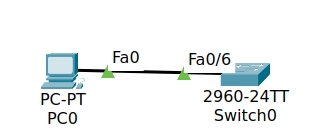
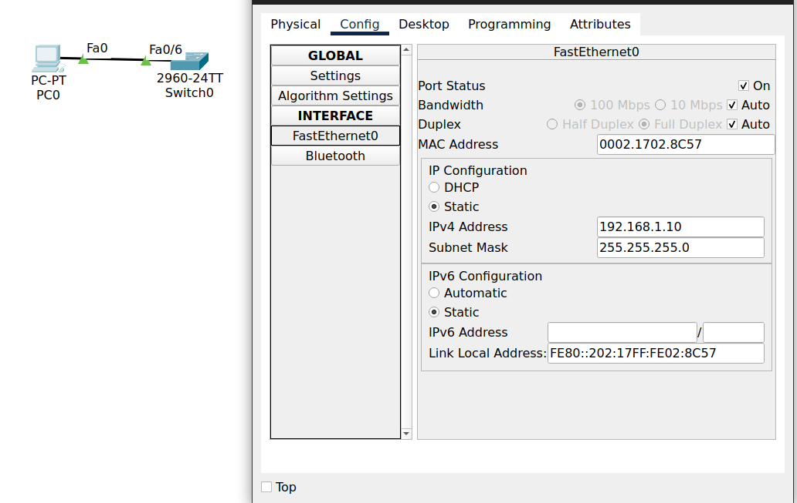

# Лабораторная работа. Базовая настройка коммутатора 
## **Цель**:

Создание сети и настройка основных параметров устройства.

## **Описание/Пошаговая инструкция выполнения домашнего задания**:

В ходе данной работы вам предстоит построить простую топологию, используя Ethernet-кабель локальной сети, и получить доступ к коммутатору Cisco, используя консольное подключение и методы удаленного доступа. Перед настройкой базовых параметров коммутатора нужно проверить настройки коммутатора по умолчанию. Необходимо также показать использование IP-адреса управления для удаленного управления коммутатором.

**Подробное описание задания в методичке в материалах к занятию.**

Готовые конфигурации необходимо оформить на github с описанием проделанной работы, используя markdown.

## Критерии оценки:

Статус "Принято" ставится при выполнении следующих критериев:

- работа выполнена верно
- документация включает все настройки и изображения  
    (допускается вариант, если документация есть, но учтены не все настройки)
--- 
## часть первая
- **Создание сети** и 
- **проверка настроек коммутатора по умолчанию**
### Шаг 1. Создайте сеть ...
Взял коммутатор, компьютер, подключился к коммутатору по последовательному порту

*Почему нужно использовать консольное подключение для первоначальной настройки коммутатора? Почему нельзя подключиться к коммутатору через Telnet или SSH?* Потому что ещё не настроены интерфейсы - у них нет никаких IP-адресов и к ним невозможно обратиться.

### Шаг 2. Посмотреть параметры по умолчанию
посмотреть параметры: текущие настройки коммутатора, данные IOS, свойства интерфейса, сведения о VLAN и флеш-память.
что может show?
```
Switch#?
Exec commands:
  clear       Reset functions
...
  setup       Run the SETUP command facility
  show        Show running system information

Switch#show
% Incomplete command.
Switch#show 
Switch#show 
Switch#show ?
  ...
  boot               show boot attributes
  etherchannel       EtherChannel information
  flash:             display information about flash: file system
  hosts              IP domain-name, lookup style, nameservers, and host table
  interfaces         Interface status and configuration
  ip                 IP information
  mac                MAC configuration
  ...
  running-config     Current operating configuration
  startup-config     Contents of startup configuration
  users              Display information about terminal lines
  version            System hardware and software status
  vlan               VTP VLAN status
```
#### пункты a, b
**Текущие настройки коммутатора.**
```
Switch>enable
Switch#show run
Switch#show running-config
```
На устройстве 24 интерфейса FastEthernet и 2 интерфейса GigabitEthernet,
Диапазон vty линий 0-15
``` running-config
Building configuration...

Current configuration : 1080 bytes
!
version 15.0
no service timestamps log datetime msec
no service timestamps debug datetime msec
no service password-encryption
!
hostname Switch
!
!
!
!
!
!
spanning-tree mode pvst
spanning-tree extend system-id
!
interface FastEthernet0/1
!
...
!
interface FastEthernet0/24
!
interface GigabitEthernet0/1
!
interface GigabitEthernet0/2
!
interface Vlan1
 no ip address
 shutdown
!
!
!
!
line con 0
!
line vty 0 4
 login
line vty 5 15
 login
!
!
!
!
end

Switch#
```
#### пункт c
стартовый конфиг читается из файла `config.text`, но его нету на флешке.
```
Switch#show boot
BOOT path-list      : 
Config file         : flash:/config.text
Private Config file : flash:/private-config.text
Enable Break        : no
Manual Boot         : no
HELPER path-list    : 
Auto upgrade        : yes
NVRAM/Config file
      buffer size:   65536
```
####  пункт i
Текущие настройки хранятся в оперативной памяти, а не во флешке, стартап загружается из флешки при старте.  Так как ещё никакого конфига не сохранили - нету файла конфигурации.
```
Switch# show startup-config 
startup-config is not present
Switch#
Switch#show flash
Directory of flash:/

    1  -rw-     4670455          <no date>  2960-lanbasek9-mz.150-2.SE4.bin

64016384 bytes total (59345929 bytes free)
```
#### пункт g
информация об ОС. 
Версия системы15.0(2) SE4
файл ОС - `2960-lanbasek9-mz.150-2.SE4.bin`
```
Switch#show version 
Cisco IOS Software, C2960 Software (C2960-LANBASEK9-M), Version 15.0(2)SE4, RELEASE SOFTWARE (fc1)
Technical Support: http://www.cisco.com/techsupport
Copyright (c) 1986-2013 by Cisco Systems, Inc.
Compiled Wed 26-Jun-13 02:49 by mnguyen

ROM: Bootstrap program is C2960 boot loader
BOOTLDR: C2960 Boot Loader (C2960-HBOOT-M) Version 12.2(25r)FX, RELEASE SOFTWARE (fc4)

Switch uptime is 39 minutes
System returned to ROM by power-on
System image file is "flash:c2960-lanbasek9-mz.150-2.SE4.bin"

...

cisco WS-C2960-24TT-L (PowerPC405) processor (revision B0) with 65536K bytes of memory.
Processor board ID FOC1010X104
Last reset from power-on
1 Virtual Ethernet interface
24 FastEthernet interfaces
2 Gigabit Ethernet interfaces
The password-recovery mechanism is enabled.

64K bytes of flash-simulated non-volatile configuration memory.
Base ethernet MAC Address       : 00:60:70:8E:7A:DA
Motherboard assembly number     : 73-10390-03
Power supply part number        : 341-0097-02
Motherboard serial number       : FOC10093R12
Power supply serial number      : AZS1007032H
Model revision number           : B0
Motherboard revision number     : B0
Model number                    : WS-C2960-24TT-L
System serial number            : FOC1010X104
Top Assembly Part Number        : 800-27221-02
Top Assembly Revision Number    : A0
Version ID                      : V02
CLEI Code Number                : COM3L00BRA
Hardware Board Revision Number  : 0x01


Switch Ports Model              SW Version            SW Image
------ ----- -----              ----------            ----------
*    1 26    WS-C2960-24TT-L    15.0(2)SE4            C2960-LANBASEK9-M


Configuration register is 0xF


Switch#
```
#### пункт d, e
из пункта  g MAC-адрес устройства **00:60:70:8E:7A:DA**
Никаких IP-адресов не назначено.
Все интерфейсы выключены.
Никаких данных не вижу.

```
Switch#show ip interface brief
Interface              IP-Address      OK? Method Status  Protocol 
FastEthernet0/1        unassigned      YES manual down    down 
...
FastEthernet0/24       unassigned      YES manual down    down 
GigabitEthernet0/1     unassigned      YES manual down    down 
GigabitEthernet0/2     unassigned      YES manual down    down 
Vlan1                  unassigned      YES manual administratively down down
```


```
Switch>show interface
FastEthernet0/1 is down, line protocol is down (disabled)
  Hardware is Lance, address is 00e0.b040.ad01 (bia 00e0.b040.ad01)
 BW 100000 Kbit, DLY 1000 usec,
     reliability 255/255, txload 1/255, rxload 1/255
  Encapsulation ARPA, loopback not set
  Keepalive set (10 sec)
  Half-duplex, 100Mb/s
  input flow-control is off, output flow-control is off
  ARP type: ARPA, ARP Timeout 04:00:00
  Last input 00:00:08, output 00:00:05, output hang never
  Last clearing of "show interface" counters never
  Input queue: 0/75/0/0 (size/max/drops/flushes); Total output drops: 0
  Queueing strategy: fifo
  Output queue :0/40 (size/max)
  5 minute input rate 0 bits/sec, 0 packets/sec
  5 minute output rate 0 bits/sec, 0 packets/sec
     956 packets input, 193351 bytes, 0 no buffer
     Received 956 broadcasts, 0 runts, 0 giants, 0 throttles
     0 input errors, 0 CRC, 0 frame, 0 overrun, 0 ignored, 0 abort
     0 watchdog, 0 multicast, 0 pause input
     0 input packets with dribble condition detected
     2357 packets output, 263570 bytes, 0 underruns
     0 output errors, 0 collisions, 10 interface resets
     0 babbles, 0 late collision, 0 deferred
     0 lost carrier, 0 no carrier
     0 output buffer failures, 0 output buffers swapped out

  ... ещё 23 FastEthernet0/n

GigabitEthernet0/1 is down, line protocol is down (disabled)
  Hardware is Lance, address is 00e0.b040.ad19 (bia 00e0.b040.ad19)
 BW 1000000 Kbit, DLY 1000 usec,
     reliability 255/255, txload 1/255, rxload 1/255
  Encapsulation ARPA, loopback not set
  Keepalive set (10 sec)
  Half-duplex, 1000Mb/s
  input flow-control is off, output flow-control is off
  ARP type: ARPA, ARP Timeout 04:00:00
  Last input 00:00:08, output 00:00:05, output hang never
  Last clearing of "show interface" counters never
  Input queue: 0/75/0/0 (size/max/drops/flushes); Total output drops: 0
  Queueing strategy: fifo
  Output queue :0/40 (size/max)
  5 minute input rate 0 bits/sec, 0 packets/sec
  5 minute output rate 0 bits/sec, 0 packets/sec
     956 packets input, 193351 bytes, 0 no buffer
     Received 956 broadcasts, 0 runts, 0 giants, 0 throttles
     0 input errors, 0 CRC, 0 frame, 0 overrun, 0 ignored, 0 abort
     0 watchdog, 0 multicast, 0 pause input
     0 input packets with dribble condition detected
     2357 packets output, 263570 bytes, 0 underruns
     0 output errors, 0 collisions, 10 interface resets
     0 babbles, 0 late collision, 0 deferred
     0 lost carrier, 0 no carrier
     0 output buffer failures, 0 output buffers swapped out

... GigabitEthernet0/2 аналогично

Vlan1 is administratively down, line protocol is down
  Hardware is CPU Interface, address is 0060.708e.7ada (bia 0060.708e.7ada)
  MTU 1500 bytes, BW 100000 Kbit, DLY 1000000 usec,
     reliability 255/255, txload 1/255, rxload 1/255
  Encapsulation ARPA, loopback not set
  ARP type: ARPA, ARP Timeout 04:00:00
  Last input 21:40:21, output never, output hang never
  Last clearing of "show interface" counters never
  Input queue: 0/75/0/0 (size/max/drops/flushes); Total output drops: 0
  Queueing strategy: fifo
  Output queue: 0/40 (size/max)
  5 minute input rate 0 bits/sec, 0 packets/sec
  5 minute output rate 0 bits/sec, 0 packets/sec
     1682 packets input, 530955 bytes, 0 no buffer
     Received 0 broadcasts (0 IP multicast)
     0 runts, 0 giants, 0 throttles
     0 input errors, 0 CRC, 0 frame, 0 overrun, 0 ignored
     563859 packets output, 0 bytes, 0 underruns
     0 output errors, 23 interface resets
     0 output buffer failures, 0 output buffers swapped out

Switch>
```

----
#### пункт g 
подсоединяю кабель изернет



в консоле обновляется состояние линии, 
```
%LINK-5-CHANGED: Interface FastEthernet0/6, changed state to up

%LINEPROTO-5-UPDOWN: Line protocol on Interface FastEthernet0/6, changed state to up
```
ip хосту назначил в через графический конфигуратор

настраиваю интерфейс со стороны циски:
```
Switch(config)#interface vlan 1
Switch(config-if)#ip address 192.168.1.2 255.255.255.0
Switch(config-if)#no shutdown

Switch(config-if)#
%LINK-5-CHANGED: Interface Vlan1, changed state to up

%LINEPROTO-5-UPDOWN: Line protocol on Interface Vlan1, changed state to up

Switch(config)#interface fastEthernet 0/6
Switch(config-if)#no shutdown 
```
Теперь хост и коммутатор пингуют друг друга.
 теперь
 ```
 Switch#show ip interface brief 
Interface              IP-Address      OK? Method Status  Protocol 
FastEthernet0/1        unassigned      YES manual down    down 
...
FastEthernet0/6        unassigned      YES manual up      up 
...
FastEthernet0/24       unassigned      YES manual down    down 
GigabitEthernet0/1     unassigned      YES manual down    down 
GigabitEthernet0/2     unassigned      YES manual down    down 
Vlan1                  192.168.1.2     YES manual up      up
 ```
и появился IP-адрес в
```
Switch#show interface v
Switch#show interface vlan 1
Vlan1 is up, line protocol is up
  Hardware is CPU Interface, address is 0060.708e.7ada (bia 0060.708e.7ada)
  Internet address is 192.168.1.2/24
  MTU 1500 bytes, BW 100000 Kbit, DLY 1000000 usec,
  ...
```
#### пункт h
```
Switch#show interface f0/6
FastEthernet0/6 is up, line protocol is up (connected)
  Hardware is Lance, address is 00e0.b040.ad06 (bia 00e0.b040.ad06)
 BW 100000 Kbit, DLY 1000 usec,
     reliability 255/255, txload 1/255, rxload 1/255
  Encapsulation ARPA, loopback not set
  Keepalive set (10 sec)
  Full-duplex, 100Mb/s
  input flow-control is off, output flow-control is off
  ARP type: ARPA, ARP Timeout 04:00:00
  Last input 00:00:08, output 00:00:05, output hang never
  Last clearing of "show interface" counters never
  Input queue: 0/75/0/0 (size/max/drops/flushes); Total output drops: 0
  Queueing strategy: fifo
  Output queue :0/40 (size/max)
  5 minute input rate 0 bits/sec, 0 packets/sec
  5 minute output rate 0 bits/sec, 0 packets/sec
     956 packets input, 193351 bytes, 0 no buffer
     Received 956 broadcasts, 0 runts, 0 giants, 0 throttles
     0 input errors, 0 CRC, 0 frame, 0 overrun, 0 ignored, 0 abort
     0 watchdog, 0 multicast, 0 pause input
     0 input packets with dribble condition detected
     2357 packets output, 263570 bytes, 0 underruns
     0 output errors, 0 collisions, 10 interface resets
     0 babbles, 0 late collision, 0 deferred
     0 lost carrier, 0 no carrier
     0 output buffer failures, 0 output buffers swapped out
```
теперь интерфейс включен. (2я строчка)
## Часть 2
### Шаг 1
#### пункт a
сменил название коммутатора,
```
Switch(config)#no ip domain-lookup
Switch(config)#hostname S1
S1(config)#
```
Задал пароль
`S1(config)#enable password cisco`
```
S1(config)#line vty 0 4
S1(config-line)# 
```
сделал баннер
```
S1(config)#banner motd #
Enter TEXT message.  End with the character '#'.
Unauthorized access is strictly prohibited. #
```
#### пункт b
IP-адреса задал в предыдущем шаге (часть 1, шаг 2, пункт  g)
#### пункт c
для **line vty 0 4** задал пароль и разрешил подключение по telnet,
```
S1(config)#line vty 0 4
S1(config-line)# password cisco
S1(config-line)# login
S1(config-line)# transport input telnet
```
теперь смог подцепиться по телнету. 
### Шаг 2
IP-адреса задал в предыдущем шаге (часть 1, шаг 2, пункт  g)

## Часть 3
### Шаг 1
как теперь выглядит конфигурация:
```
S1#show running-config 
Building configuration...

Current configuration : 1298 bytes
!
version 15.0
no service timestamps log datetime msec
no service timestamps debug datetime msec
service password-encryption
!
hostname S1
!
enable password 7 0822455D0A16
!
!
!
no ip domain-lookup
!
!
!
spanning-tree mode pvst
spanning-tree extend system-id
!
interface FastEthernet0/1
!
...
!
interface FastEthernet0/24
!
interface GigabitEthernet0/1
!
interface GigabitEthernet0/2
!
interface Vlan1
 ip address 192.168.1.2 255.255.255.0
!
banner motd ^C
Unauthorized access is strictly prohibited. ^C
!
!
!
line con 0
 login
!
line vty 0 4
 password 7 0822455D0A16
 login
 transport input telnet
line vty 5
 password 7 0822404F1A0A
 login
line vty 6 15
 login
!
!
!
!
end


S1# 
```
Пропускная способность канала 100Mbit (6 строка)
```
S1# show interface vla 1
Vlan1 is up, line protocol is up
  Hardware is CPU Interface, address is 0060.708e.7ada (bia 0060.708e.7ada)
  Internet address is 192.168.1.2/24
  MTU 1500 bytes, BW 100000 Kbit, DLY 1000000 usec,
     reliability 255/255, txload 1/255, rxload 1/255
  Encapsulation ARPA, loopback not set
  ARP type: ARPA, ARP Timeout 04:00:00
  Last input 21:40:21, output never, output hang never
  Last clearing of "show interface" counters never
  Input queue: 0/75/0/0 (size/max/drops/flushes); Total output drops: 0
  Queueing strategy: fifo
  Output queue: 0/40 (size/max)
  5 minute input rate 0 bits/sec, 0 packets/sec
  5 minute output rate 0 bits/sec, 0 packets/sec
     1682 packets input, 530955 bytes, 0 no buffer
     Received 0 broadcasts (0 IP multicast)
     0 runts, 0 giants, 0 throttles
     0 input errors, 0 CRC, 0 frame, 0 overrun, 0 ignored
     563859 packets output, 0 bytes, 0 underruns
     0 output errors, 23 interface resets
     0 output buffer failures, 0 output buffers swapped out
```
### Шаг 2
Проверяю пинги, и вход в телнет.
#### Со стороны коммутатора:

#### Со стороны хоста:

#### Подключение по телнет:

