# Лабораторная работа. Базовая настройка коммутатора 
## **Цель*:
 1. Создание и настройка сети
 2. Изучение таблицы МАС-адресов коммутатора
## Часть первая. Создание сети и настройка основных параметров устройства.
### Шаг первый. строю схему
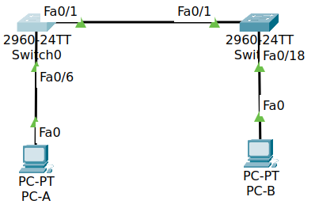
### Шаг второй. настроил узлы ПК
переименовал и установил IP адреса для хостов
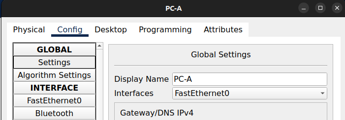
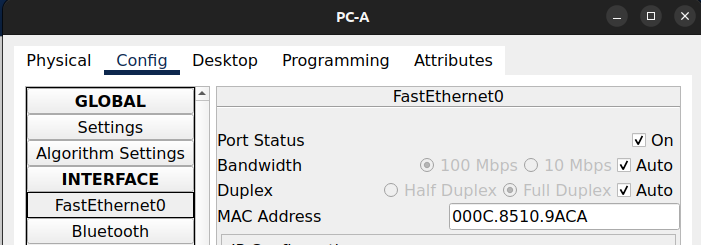
### Шаг третий
> Выполните инициализацию и перезагрузку коммутаторов.
???
### Шаг четвертый. настроил коммутаторы
На примере коммутатора S2
- настроил имена
```
Switch>enable
Switch#configure terminal 
Enter configuration commands, one per line.  End with CNTL/Z.
Switch(config)#hostname S2
```
- настроил IP
```
S2(config)#interface vlan 1
S2(config-if)#ip address 192.168.1.12 255.255.255.0
S2(config-if)#no shutdown 
```
- назначил пароль **class** для привелегированного режима
`S2(config-if)#enable secret class`
- назначил пароль **cisco** для консоли
```
S2(config)#line console 0
S2(config-line)#password cisco
S2(config)#login
```
> Вопрос - здесь возможности хранить код секьюрно нету?
- назначил пароль **cisco** для VTY 
```
S2(config)#line vty 0
S2(config-line)#password cisco
S2(config)#login
```
- сохранил настройки.
`S2#copy running-config startup-config`

## Часть вторая. Создание сети и настройка основных параметров устройства.
### Шаг первый 
- узнаю мак адреса сетевых карт ПК
`ipconfig /all`
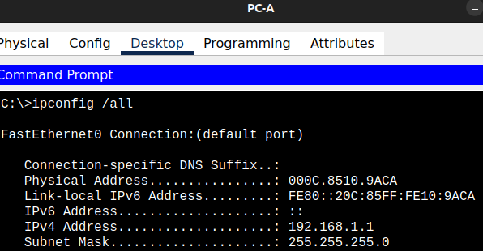
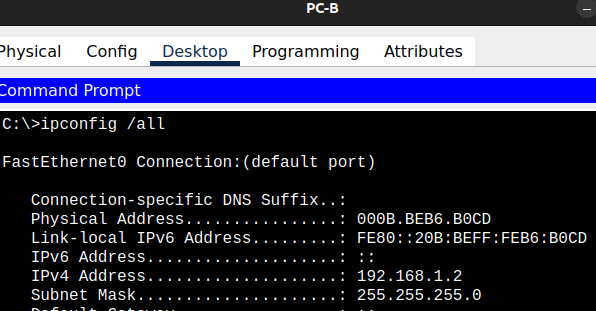
- узнаю мак адреса интерфейсов коммутаторов
`show interface F0/1`
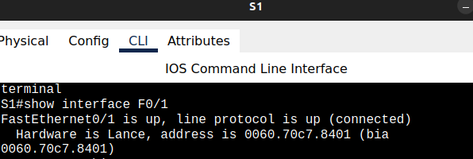
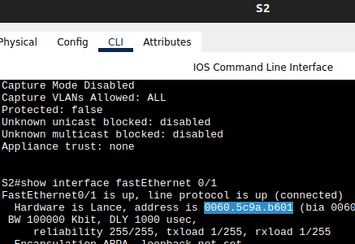

соберу все адреса в таблицу

| device    | MAC               | IP           |
| --------- | ----------------- | ------------ |
| PC-A      | 000C.8510.9ACA    | 192.168.1.1  |
| PC-B      | 000B.BEB6.B0CD    | 192.168.1.2  |
| S1 fa 0/1 | 0060.70c7.8401    |              |
| S2 fa 0/1 | 0060.5c9a.b601    |              |
| S1        | 00:E0:8F:D4:2D:24 | 192.168.1.11 |
| S2        | 00:07:EC:E4:AE:40 | 192.168.1.12 |
> Вопрос: у каждого интерфейса свой мак адрес (последние цифры меняются). (`show interfaces`), у коммутаторов есть мак в `show version` - в чем разница? Зачем мак каждому отдельному интерфейсу, если в рамках одного устройства все интерфейсы могут использовать одинаковый мак адрес? 
### Шаг второй 
- смотрю таблицу МАС-адресов коммутаторов
таблица мак адресов на S1
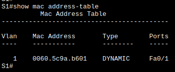
таблица мак адресов на S2
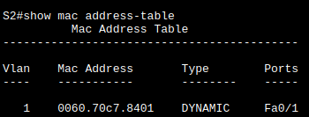
1. Записаны ли в таблице МАС-адресов какие-либо МАС-адреса?
	Да
2. Какие МАС-адреса записаны в таблице?
	 Присутствуют MAC-адреса интерфейсов соседних коммутаторов
3. С какими портами коммутатора они сопоставлены и каким устройствам принадлежат?
	Адреса сопоставлены с интерфейсами, которые соединяют коммутаторы.
4. Если вы не записали МАС-адреса сетевых устройств в шаге 1, как можно определить, каким устройствам принадлежат МАС-адреса, используя только выходные данные команды **show mac address-table**? 
	 можно добавить знание схемы соединений и сопоставить мак адрес из таблицы с ответным портом для интерфейса коммутатора.
5. Работает ли это решение в любой ситуации?
	Не могу придумать ситуацию, разве что нет физического соединения или если интерфейс с другой стороны выключен.
- смотрю таблицу МАС-адресов
####  очищаю таблицу 
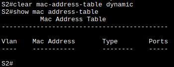
1. Указаны ли в таблице МАС-адресов адреса для VLAN 1? Указаны ли другие МАС-адреса? 
	1. Нет, никаких записей в таблице после очистки нету, 
	2. со временем вновь появляется запись для Fa0/1, не знаю почему - какая-то внутренняя жизнь. 
- смотрю таблицу на хосте PC-B до 
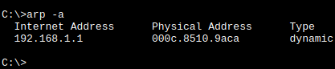
присутствует запись от хостов. Вообще говоря после `arp -d` возвращается `No ARP Entries Found` но последующие действия с коммутатором или хостами приводят к появлению записей. Не знаю почему.
####  отправляю пинги с PC-B на остальные узлы сети 
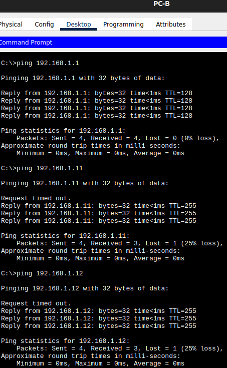
теперь таблица MAC-адресов на хосте PC-B
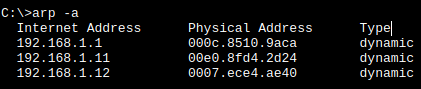
теперь таблицы MAC-адресов на коммутаторах
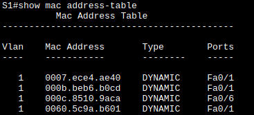
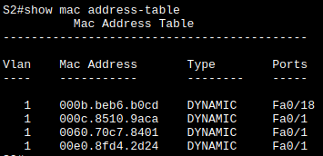
1. Добавил ли коммутатор в таблицу МАС-адресов дополнительные МАС-адреса? Если да, то какие адреса и устройства?
	Да, добавил, для всех устройств которым запросы отправили.
2. Появились ли в ARP-кэше компьютера PC-B дополнительные записи для всех сетевых устройств, которым были отправлены эхо-запросы?
	Да, появились соответствующие записи.
# выводы
Таким образом я построил сеть посложнее, обеспечил связность устройств через цепочку коммутаторов и продемонстрировал, что хост выяснил ARP - на какой мак адрес отправлять пакет по IP, а все промежуточные узлы выяснили в какие интерфейсы отправлять тот или иной кадр по мак адресу назначения.
> Что за адреса такие странные 0007.ece4.ae40 и 00e0.f8d4.2d24? это тот самый "Игнорируйте МАС-адреса, сопоставленные с центральным процессором"?


