# Лабораторная работа. Настройка IPv6-адресов на сетевых устройствах 
## цели
- Настройка топологии и конфигурация основных параметров маршрутизатора и коммутатора
- Ручная настройка IPv6-адресов
- Проверка сквозного соединения

## Часть 1. Настройка топологии и конфигурация основных параметров маршрутизатора и коммутатора
- собрал схему
- назначил имена хостов
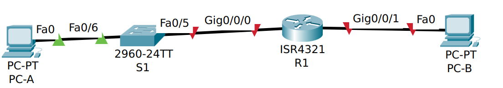

## Часть 2. Ручная настройка IPv6-адресов
таблица адресации из задания

|      |      |      |      |      |      |
| --- | --- | --- | --- | --- | --- |
|Устройство|Интерфейс|IPv6-адрес|Link local IPv6-адрес|Длина префикса|Шлюз по умолчанию|
|R1|G0/0/0|2001:db8:acad:a::1|fe80::1|64|—|
|R1|G0/0/1|2001:db8:acad:1::1|fe80::1|64|—|
|S1|VLAN 1|2001:db8:acad:1::b|fe80::b|64|—|
|PC-A|NIC|2001:db8:acad:1::3|SLACC|64|fe80::1|
|PC-B|NIC|2001:db8:acad:a::3|SLACC|64|fe80::1|

### Шаг 1. Назначьте IPv6-адреса интерфейсам Ethernet на R1.
```
enable
config term
interf gi 0/0/0
ipv6 add fe80::1 link
ipv6 add 2001:db8:acad:a::1/64
no shut
exit
interf gi 0/0/1
ipv6 add fe80::1 link
ipv6 add 2001:db8:acad:1::1/64
no shut
exit

```
теперь адреса назначены, проверим с помощью `show running-config`

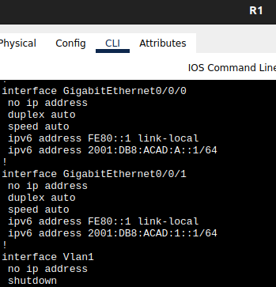

так же поднялись сети на роутере.
с помощью `show ipv6 interface brief` ещё нагляднее
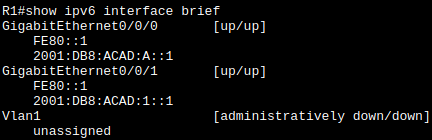

если сразу линк локал адрес не назначить - он сгенерируется на основе MAC-адреса интерфейса (см EUI-64)
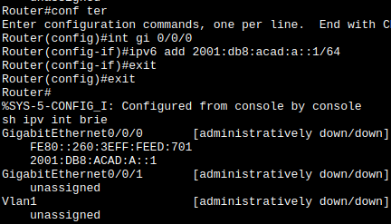

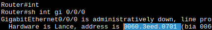

> Какие группы многоадресной рассылки назначены интерфейсу G0/0?
### Шаг 2. Активируйте IPv6-маршрутизацию на R1.
пока что адрес хосту не назначается

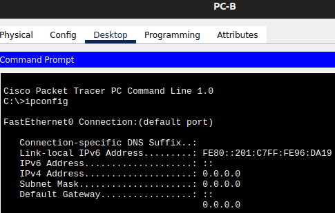

на роутере выполним `ipv6 unicast-routing` и поставим автматическое определение IPv6-адреса на хосте

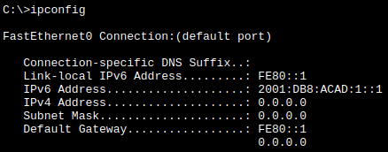
> Почему PC-B получил глобальный префикс маршрутизации и идентификатор подсети, которые вы настроили на R1?

### Шаг 3. Назначьте IPv6-адреса интерфейсу управления (SVI) на S1.
**SVI** - Switch virtual interface
**SDM** - Switch Database Manager
на коммутаторе сначала нужно настроить sdm:
> SDM коммутатора 2960 по умолчанию не поддерживает ipv6 в коммутаторе может понадобиться `sdm prefer dual-ipv4-and-ipv6 default` или `lanbase-routing` для включения IPv6-адресации.
смотрим
`S1# show sdm prefer`
> на что смотреть то в итоге? должно быть `The current template is "dual-ipv4-and-ipv6 default" template.`
устанавливаем
```
S1# configure terminal
S1(config)# sdm prefer dual-ipv4-and-ipv6 default
S1(config)# end
S1# reload
```
Теперь настройка svi
```
enable
config term
interf vlan 1
ipv6 add fe80::b link
ipv6 add 2001:db8:acad:1::b/64
no shut
exit
exit
```

`show ipv6 interface brief` - результат

### Шаг 4. Назначьте компьютерам статические IPv6-адреса.
автоматические адреса уже настроились в шаге 1, теперь задам статические
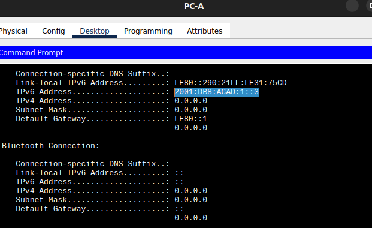
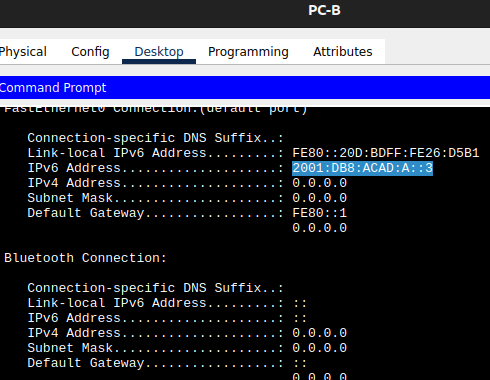

## Часть 3. Проверка сквозного подключения
связности нет, 
перепутал местами интерфейсы роутера, меняю местами
связности нет, делаю на роутере
`ipv6 unicast-routing`
связности нет, делаю на интерфейсах роутера
`ipv6 enable`
связности нет, всё перепроверил, сохранил настройки, перезагрузил коммутатор и маршрутизатор
связность появилась
### С хоста PC-A
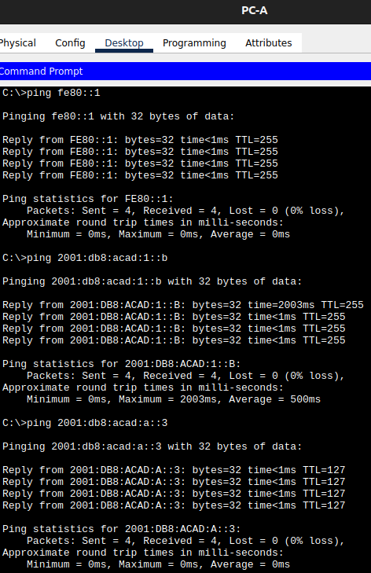
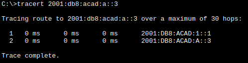
### С хоста PC-B
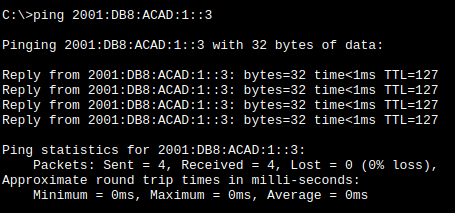
# Вопросы для повторения
1. Почему обоим интерфейсам Ethernet на R1 можно назначить один и тот же локальный адрес канала — FE80::1?
2. Какой идентификатор подсети в индивидуальном IPv6-адресе 2001:db8:acad::aaaa:1234/64?