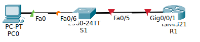
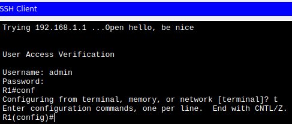
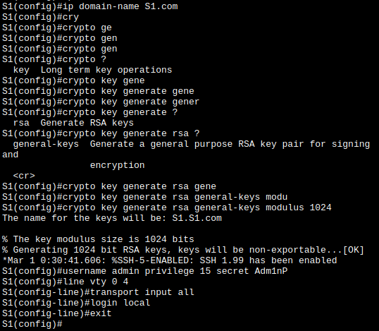
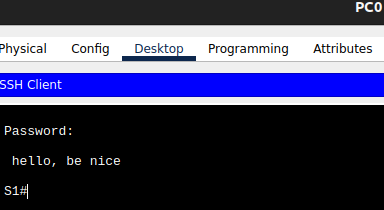
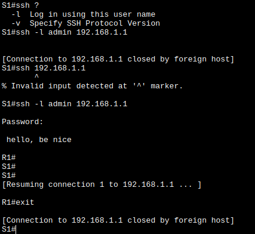

# Лабораторная работа. Доступ к сетевым устройствам по протоколу SSH
## Задачи
- **Часть 1. Настройка основных параметров устройства**
- **Часть 2. Настройка маршрутизатора для доступа по протоколу SSH**
- **Часть 3. Настройка коммутатора для доступа по протоколу SSH**
- **Часть 4. SSH через интерфейс командной строки (CLI) коммутатора**

Собрал схему



| Устройство | Интерфейс | IP-адрес     | Маска подсети | Шлюз по умолчанию |
| ---------- | --------- | ------------ | ------------- | ----------------- |
| R1         | G0/0/1    | 192.168.1.1  | 255.255.255.0 | —                 |
| S1         | VLAN 1    | 192.168.1.11 | 255.255.255.0 | 192.168.1.1       |
| PC-A       | NIC       | 192.168.1.3  | 255.255.255.0 | 192.168.1.1       |
На R1
```
enable
config term
	hostname R1
	service password-encryption
	banner motd x hello, be nice x
	no ip domain-lookup
	
	line console 0
		password cisco
		login
	exit

	line vty 0 15
		password cisco
		login
	exit

	ip routing
		
	interface gi 0/0/1
		ip address 192.168.1.1 255.255.255.0
		no shut
	exit
exit

clock set 18:18:00 jan 25 2026
terminal history size 256

copy ru st
```
На S1
```
enable
config term
	hostname S1
	service password-encryption
	banner motd x hello, be nice x
	no ip domain-lookup
	
	line console 0
		password cisco
		login
	exit

	line vty 0 15
		password cisco
		login
	exit
		
	interface vlan 1
		ip address 192.168.1.11 255.255.255.0
		no shut
	exit
	ip default-gateway 192.168.1.1
exit

clock set 18:18:00 jan 25 2026
terminal history size 256

copy ru st
```


## **Часть 2. Настройка маршрутизатора для доступа по протоколу SSH**
```
ip domain-name R1.com
crypto key generate rsa general-keys modulus 1024
username admin privilege 15 secret Adm1nP

line vty 0 4
	transport input all
	login local
exit
```
получается подключиться



- **Часть 3. Настройка коммутатора для доступа по протоколу SSH**
Аналогично для S1:
```
ip domain-name S1.com
crypto key generate rsa general-keys modulus 1024
username admin privilege 15 secret Adm1nP

line vty 0 4
	transport input all
	login local
exit
```

И подключение по ssh работает:



# **Часть 4. SSH через интерфейс командной строки (CLI) коммутатора**
```
ssh ?
ssh -l admin 192.168.1.1
```
Почемуто ключ не был сгенерирован на коммутаторе, поэтому сначала связь не устанавливалась, но в итоге получилось.

