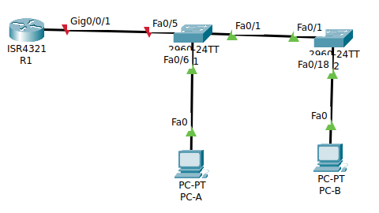
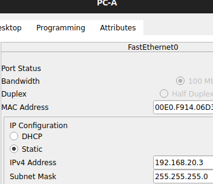
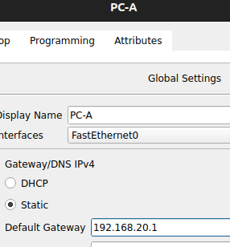
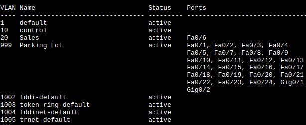
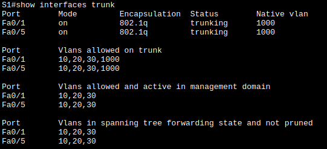
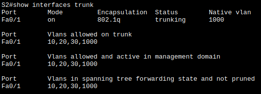
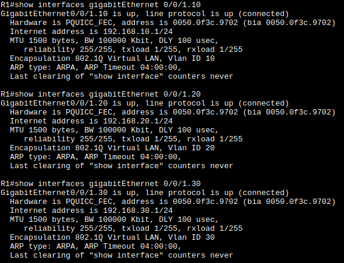
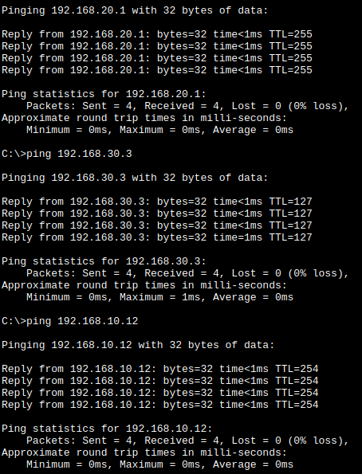
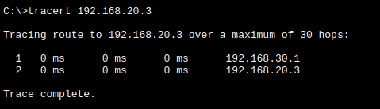

# Лабораторная работа. Внедрение маршрутизации между виртуальными локальными сетями
## цели
- Создание сети и настройка основных параметров устройства
- Создание сетей VLAN и назначение портов коммутатора
- Настройка транка 802.1Q между коммутаторами.
- Настройка маршрутизации между сетями VLAN
- Проверка, что маршрутизация между VLAN работает
## Часть 1. Создание сети и настройка основных параметров устройства
### Шаг 1. Создайте сеть согласно топологии.
собираю схему из методички

### Шаг 2-3. Настройте базовые параметры для маршрутизатора и коммутаторов.
например для S1
```
enable
conf term
	hostname S1

	no ip domain-lookup

	enable secret class

	line console 0
		password cisco
		login
	exit

	line vty 0 15
		password cisco
		login
	exit

	service password-encryption
	
	banner motd x hello, be nice x
	
exit

copy ru st

clock set 07:21:00 dec 12 2025
```
### Шаг 4. Настройте узлы ПК.
например для PC-A



## Часть 2. Создание сетей VLAN и назначение портов коммутатора
### Шаг 1. Создаю сети VLAN на коммутаторах.
#### названия для vlan
```
vlan 10
	name Control
exit

vlan 20
	name Sales
exit

vlan 30
	name Operations
exit

vlan 999
	name Parking_Lot
exit

vlan 1000
	name native
exit
```
#### На S1
Создал и назвал  необходимые VLAN, настроил интерфейс управления и шлюз по умолчанию:
```
# in S1(config)#
interface vlan 10
	ip address 192.168.10.11 255.255.255.0
	no shut
exit

interface vlan 999
	description Parking_Lot
exit
```
Назначил все неиспользуемые порты коммутатора VLAN Parking_Lot:
```
interface range fa 0/2-4, fa 0/7-24, gi 0/1-2
	switchport mode access
	switchport access vlan 999
	shutdown
exit
```
Назначил сети VLAN соответствующим интерфейсам коммутатора:
```
interface fastEthernet 0/6
	switchport access vlan 20
exit
```

Проверяю чего получилось `show vlan brief`:


#### На S2
Создал и назвал  необходимые VLAN, настроил интерфейс управления и шлюз по умолчанию, заодно настроил интерфейс управления и шлюз по умолчанию:
```
# in S2(config)#
interface vlan 10
	ip address 192.168.10.12 255.255.255.0
	no shut
exit

ip default-gateway 192.168.1.10
```
Назначил все неиспользуемые порты коммутатора VLAN Parking_Lot:
```
interface range fa 0/2-17, fa 0/19-24, gi 0/1-2
	switchport mode access
	switchport access vlan 999
	shutdown
exit
```
Назначил сети VLAN соответствующим интерфейсам коммутатора:
```
interface fastEthernet 0/18
	switchport access vlan 30
exit
```
интерфейс 0/1 - нативный
```
interface fastEthernet 0/1
	switchport access vlan 1000
exit
```
Проверяю чего получилось `show vlan brief`:



1. Назначьте все неиспользуемые порты коммутатора VLAN Parking_Lot, настройте их для статического режима доступа и административно деактивируйте их.
### Шаг 2. Назначьте сети VLAN соответствующим интерфейсам коммутатора.
1. Назначьте используемые порты соответствующей VLAN (указанной в таблице VLAN выше) и настройте их для режима статического доступа.
2. Убедитесь, что VLAN назначены на правильные интерфейсы.

## Часть 3. Настройка транка 802.1Q между коммутаторами.
###  настраиваю магистральный интерфейс F0/1 и F0/5 на S1 и F0/1 на S2.
```
interface range fa 0/1, fa 0/5
	switchport mode trunk
	switchport trunk native vlan 1000
	switchport trunk allowed vlan 10,20,30,1000
	switchport nonegotiate
	no shutdown
exit
```
сохраняю настройки.
```
copy ru st
```
### проверяю транкинг
`show interfaces trunk`


### Что произойдет, если G0/0/1 на R1 будет отключен?
5й интерфейс будет выключен и "припаркован" - принудительно назначен на влан для неиспользуемых сетей.
но после того, как настрою маршрутизатор картина изменится

## Часть 4. Настройка маршрутизации между сетями VLAN
### Шаг1. Настройте маршрутизатор.
настраиваю интерфейс
```
interface gi 0/0/1
	switchport mode trunk
	switchport trunk native vlan 1000
	switchport trunk allowed vlan 10 20 30 1000
	no shutdown
exit

ip routing
```
настраиваю подинтерфейсы
```
interface gi 0/0/1.10
	encapsulation dot1Q 10
	description gateway for control
	ip address 192.168.10.1 255.255.255.0
	no shutdown
exit

interface gi 0/0/1.20
	encapsulation dot1Q 20
	description gateway for sales
	ip address 192.168.20.1 255.255.255.0
	no shutdown
exit

interface gi 0/0/1.30
	encapsulation dot1Q 30
	description gateway for operations
	ip address 192.168.30.1 255.255.255.0
	no shutdown
exit

interface gi 0/0/1.1000
	encapsulation dot1Q 1000 native
		description native gateway
	no shutdown
exit

interface gi 0/0/1
	no shutdown
exit
```
>  Убедитесь, что вспомогательные интерфейсы работают
`show interfaces gi 0/0/1.vlan`

## Часть 4. Проверьте, работает ли маршрутизация между VLAN
### Выполните следующие тесты с PC-A
1. Отправьте эхо-запрос с PC-A на шлюз по умолчанию.
2. Отправьте эхо-запрос с PC-A на PC-B.
3. Отправьте команду ping с компьютера PC-A на коммутатор S2.
все пинги проходят.

### Пройдите следующий тест с PC-B 
В окне командной строки на PC-B выполните команду **tracert** на адрес PC-A.

#### Вопрос:
Какие промежуточные IP-адреса отображаются в результатах?
отображается адрес шлюза на роутере для влана 30, к которому подсоединен PC-B
