# **Лабораторная работа. Развертывание коммутируемой сети с резервными каналами**
## цели
-  Создание сети и настройка основных параметров устройства
-  Выбор корневого моста
-  Наблюдение за процессом выбора протоколом STP порта, исходя из стоимости портов
-  Наблюдение за процессом выбора протоколом STP порта, исходя из приоритета портов
## Часть 1. Создание сети и настройка основных параметров устройства
### Шаг 1-3. создание сети и первичная настройка
собираю схему из методички

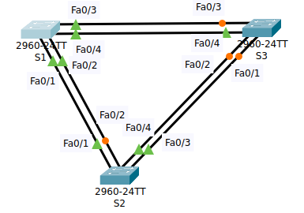

| Устройство | Интерфейс | IP-адрес    | Маска подсети |
| ---------- | --------- | ----------- | ------------- |
| S1         | VLAN 1    | 192.168.1.1 | 255.255.255.0 |
| S2         | VLAN 1    | 192.168.1.2 | 255.255.255.0 |
| S3         | VLAN 1    | 192.168.1.3 | 255.255.255.0 |

коммутаторы первично настроил
```
enable
config terminal
	hostname S3
	no ip domain-lookup
	enable secret class
	line console 0
		password cisco
		login
		exit
	line vty 0 15
		password cisco
		login
		exit
	service password-encryption
	banner motd x hello, be nice x
	interface vlan 1
		ip address 192.168.1.3 255.255.255.0
		no shutdown
		exit
	exit
copy ru st

clock set 12:21:00 dec 17 2025

```
### Шаг 4. Проверяю связь
Проверяю способность коммутаторов обмениваться эхо-запросами - работает
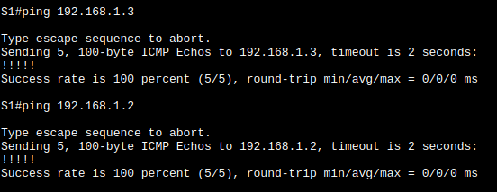
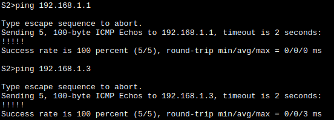
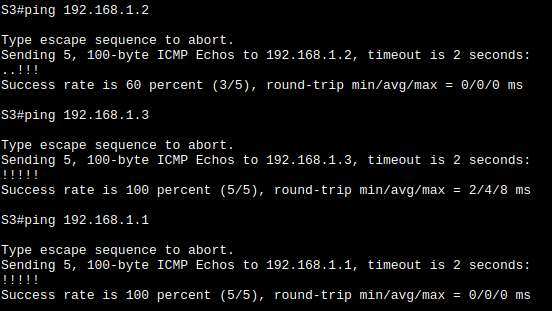

Сперва пинги не работали - переткнул кабеля и завелось.
## Часть 2. Определение корневого моста
### Шаг 1-2. Отключил все порты, настроил их как транковые
```
config terminal
	interface range fa 0/1 - fa 0/4
		shutdown
		switchport mode trunk
		exit
	exit
```
`show ip interface brief`  показывает, что все интерфейсы Administratively down
Вся схема горит красными огнями.
### Шаг 3. включить только fa0/2 и fa0/4
```
config terminal
	interface range fa 0/2, fa 0/4
		no shutdown
		exit
	exit
```
При выполнении на последнем коммутаторе 2е и 4е интерфейсы становятся желтыми и через некоторое время устаканиваются:
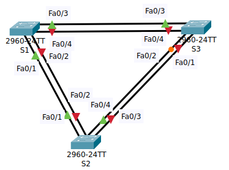
### Шаг 4. Отобразить данные протокола spanning-tree
`show spanning-tree` - основной измерительный инструмент.

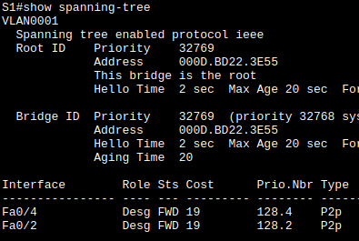

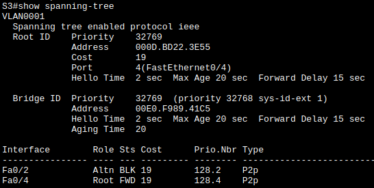

на всех коммутаторах Fa0/1 и Fa0/3 отключены и не отображаются в STP

| switch | MAC            | Fa0/2 | Fa0/4 |
| ------ | -------------- | ----- | ----- |
| S1     | 000D.BD22.3E55 | Desg  | Desg  |
| S2     | 00D0.D32C.C8EA | Root  | Desg  |
| S3     | 00E0F989.41C5  | Altn  | Root  |
- Корневым является S1 - его мак транслируют все коммутаторы как root ID. 
- Все коммутаторы периодически рассылают сообщения **BPDU** на все включеные порты и транслируют корневой коммутатор. Постепенно корневым выбирается коммутатор с минимальным **BID**. У всех коммутаторов одинаковые параметры, в частности одинаковые приоритеты по умолчанию и мы работаем в одном vlan, значит по протоколу STP(в нашем случае по PVST - протокол по умолчанию) корневым будет выбран коммутатор с минимальным маком, это и будет S1.
- **Корневыми** портами являются S2:Fa0/2 и S3:Fa0/4 - порты, по которым эти коммутаторы соединены с S1.
- **Назначеными** портами являются S1:Fa0/2, S1:Fa0/4 и S2:Fa0/4.
- **Альтернативным** портом является S3:Fa0/2
- **Почему протокол spanning-tree выбрал этот порт в качестве невыделенного (заблокированного) порта?**  
	- После окончания процедуры выбора корня и построения остовного дерева нужно заблокировать все "лишние" ребра - это магистрали между коммутаторами, оба порта которых **assigned**. Для этого порт с большей стоимостью порта (в нашем случае - с большим мак адресом) автоматически блокируется и помечается как **alternate**. Полезный трафик по нему не пересылается, но рассылка BPDU продолжается.

## Часть 3. Наблюдение за процессом выбора протоколом STP порта, исходя из стоимости портов

> В процессе отладки выяснил, что я неправильно добавил текстовые метки интерфейсов, поэтому на схеме теперь путаница, но внутри всё правильно.
### Шаг 1. Выбираю коммутатор с заблокированым портом.
Это S3, порт Fa0/2
### Шаг 2. Меняю его стоимость
по умолчанию стоимость интерфейса 19. Меняю стоимость на **корневом порте** S3. иначе никаких изменений не происходит. И надо немного подождать
```
interface fa 0/4
	spanning-tree vlan 1 cost 18
	exit
```

| Было          | Стало         |
| ------------- | ------------- |
|    | 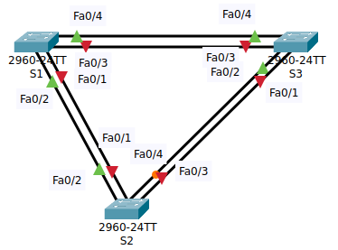   |
|  | 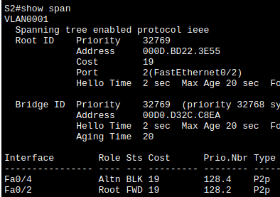 |
|  | 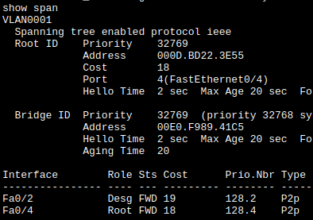 |
## Часть 4. Наблюдение за процессом выбора протоколом STP порта, исходя из приоритета портов
Нужно активировать избыточные пути до каждого из коммутаторов, чтобы просмотреть, каким образом протокол STP выбирает порт с учетом приоритета портов.
### Шаг 1. включить fa0/1 и fa0/3
На всех коммутаторах выполняю
```
config terminal
	interface range fa 0/1, fa 0/3
		no shutdown
		exit
	exit
```

время спустя проверяю состояние STP

| Было          | Стало         |
| ------------- | ------------- |
|    | 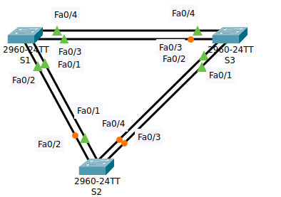 |
|  | 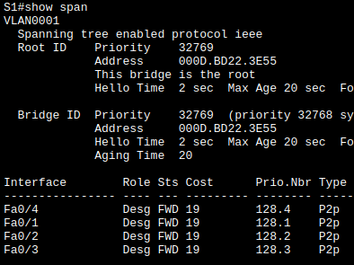 |
|  | 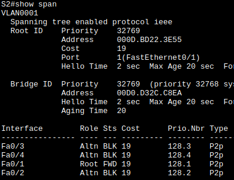 |
|  | 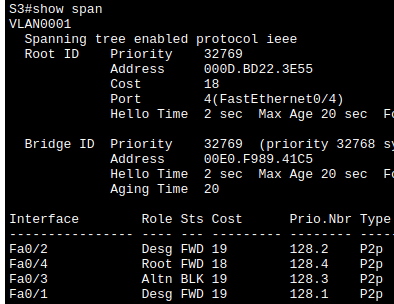 |

У S2 корневой порт сменился на fa0/1 потому что при прочих равных у него меньше порядковый номер. У S3 корневым остался fa0/4, потому что в 3м задании я ему стоимость уменьшил.

# Вопросы для повторения
 1. Какое значение протокол STP использует первым после выбора корневого моста, чтобы определить выбор порта?
	- В первую очередь сравнивается стоимость порта 
2. Если первое значение на двух портах одинаково, какое следующее значение будет использовать протокол STP при выборе порта?
	- Если стоимости портов равны, процесс сравнивает BID.
3. Если оба значения на двух портах равны, каким будет следующее значение, которое использует протокол STP при выборе порта?
	- Если BID равны, для определения корневого моста используются приоритеты портов.
	- STP объединяет приоритет порта с номером порта, чтобы разорвать связи. Наиболее низкие значения являются предпочтительными.