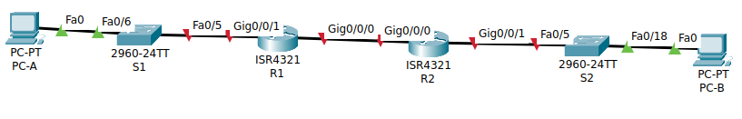
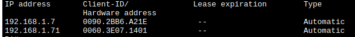
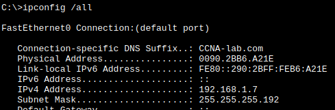
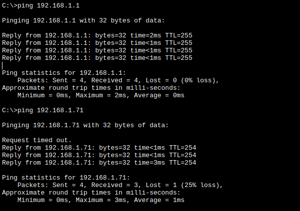
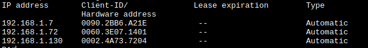

# **Лабораторная работа - Реализация DHCPv4**
## цели
- Создать сеть и настроить основные параметры устройства
- Настройка и проверка двух серверов DHCPv4 на R1
- Настройка и проверка DHCP-ретрансляции на R2
## Часть 1. Создание сети и настройка основных параметров устройства
### Шаг 1. создание сети
собираю схему из методички


### Таблица Адресации
Предварительно вычисляю подсетки, 

| Число хостов | mask | hex  | mask                |
| ------------ | ---- | ---- | ------------------- |
| 58 (<64-2)   | /26  | 0xC0 | **255.255.255.192** |
| 28 (<32-2)   | /27  | 0xE0 | **255.255.255.224** |
| 12 (<16 - 2) | /28  | 0xF0 | **255.255.255.240** |
и забочусь, чтобы они не пересекались.

| **Устройство** | **Интерфейс** | **IP-адрес**      | **Маска подсети**   | **Шлюз по умолчанию** |
| -------------- | ------------- | ----------------- | ------------------- | --------------------- |
| R1             | G0/0/0        | 10.0.0.1          | 255.255.255.252     | —                     |
| R1             | G0/0/1        | —                 | —                   | —                     |
| R1             | G0/0/1.100    | **192.168.1.1**   | **255.255.255.192** | —                     |
| R1             | G0/0/1.200    | **192.168.1.65**  | **255.255.255.224** | —                     |
| R1             | G0/0/1.1000   | —                 | —                   | —                     |
| R2             | G0/0          | 10.0.0.2          | 255.255.255.252     | —                     |
| R2             | G0/0/1        | **192.168.1.129** | **255.255.255.240** | —                     |
| S1             | VLAN 200      | **192.168.1.66**  | **255.255.255.224** |                       |
| S2             | VLAN 1        |                   |                     |                       |
| PC-A           | NIC           | DHCP              | DHCP                | DHCP                  |
| PC-B           | NIC           | DHCP              | DHCP                | DHCP                  |
### Таблица VLAN

| **VLAN** | **Имя**     | **Назначенный интерфейс**   |
| -------- | ----------- | --------------------------- |
| 1        | Нет         | S2: F0/18                   |
| 100      | Клиенты     | S1: F0/6                    |
| 200      | Управление  | S1: VLAN 200                |
| 999      | Parking_Lot | S1: F0/1-4, F0/7-24, G0/1-2 |
| 1000     | Собственная | —                           |
### Шаг 2. Хосты настроил
на хостах в любой вкладке щелкнул DHCP.
### Шаг 3. коммутаторы первично настроил
```
enable
config terminal
	hostname S1
	no ip domain-lookup
	enable secret class
	line console 0
		password cisco
		login
		exit
	line vty 0 15
		password cisco
		login
		exit
	service password-encryption
	banner motd x hello, be nice x
	exit

clock set 21:49:00 dec 21 2025

```
### Шаг 4. Создаю вланы (S1)
``` config
vlan 100
	name Clients
	exit

vlan 200
	name Control
	exit

vlan 999
	name Parking_Lot
	exit

vlan 1000
	name native
	exit
```
### Шаг 5. По вланам распределяю порты (S1)
```
interface fastEthernet 0/6
	switchport mode access
	switchport access vlan 100
	exit

interface fastEthernet 0/5
	switchport mode trunk
	switchport trunk native vlan 1000
	switchport trunk allowed vlan 100,200,1000
	switchport nonegotiate
	exit

interface vlan 200
	#ip address 192.168.1.66 255.255.255.224
	#ip address default-gateway ...
	ip address dhcp
	no shut
	exit
```
### Шаг 6. Паркую неиспользуемые порты (S1)
```
interface range fa 0/1-4, fa 0/7-24, gi 0/1-2
	switchport mode access
	switchport access vlan 999
	shutdown
	exit
```
### Шаг 7. настраиваю подинтерфейсы
на R1
``` R1
interface gi 0/0/1.100
	encapsulation dot1Q 100
	description gateway for clients
	ip address 192.168.1.1 255.255.255.192
	no shutdown
	exit

interface gi 0/0/1.200
	encapsulation dot1Q 200
	description gateway for control
	ip address 192.168.1.65 255.255.255.224
	no shutdown
	exit

interface gi 0/0/1.1000
	encapsulation dot1Q 1000 native
	description native gateway
	no shutdown
	exit

interface gi 0/0/1
	no shutdown
	exit
```
на R2
``` R2
interface gi 0/0/1
	ip address 192.168.1.129 255.255.255.240
	no shutdown
	exit
```
### Шаг 8. настраиваю интерфейсы между маршрутизаторами
на R1
``` 
interface gi 0/0/0
	ip address 10.0.0.1 255.255.255.252
	no shutdown
	exit

ip routing
```
на R2
``` R2
interface gi 0/0/0
	ip address 10.0.0.2 255.255.255.252
	no shutdown
	exit

ip routing
```
### Шаг 9. на S2 выключаю неиспользуемые порты
``` S2
interface range gi 0/0/1-2, fa0/1-4, fa0/6-17, fa0/19-24
	shutdown
	exit
```
### Шаг 10. Сохраняю настройки

```
copy ru st
```

## Часть 2. Настройка и проверка двух серверов DHCPv4 на R1
### Шаг1. Настроить R1 с пулами DHCPv4 для двух поддерживаемых подсетей. 
```
ip dhcp excluded-address 192.168.1.2 192.168.1.6
ip dhcp excluded-address 192.168.1.66 192.168.1.70
ip dhcp pool lclient
	network 192.168.1.0 255.255.255.192
	default-router 192.168.1.1
	domain-name CCNA-lab.com
	lease 2 12 30 - # не сработала
	exit

ip dhcp pool lcontrol
	network 192.168.1.64 255.255.255.224
	default-router 192.168.1.65
	domain-name CCNA-lab.com
	lease 2 12 30
	exit

ip dhcp pool rclient
	network 192.168.1.128 255.255.255.240
	default-router 192.168.1.129
	domain-name CCNA-lab.com
	exit
service dhcp
copy ru st
```
Проверяю чего получилось `show ip dhcp pool`:


Какие адреса выдал `show ip dhcp binding`:



Смотрю сообщения DHCP`show ip dhcp server statistics:
терплю фиаско


Результат на PC-A `ipconfig /all`:



Пингую роутер и коммутатор`ping 192.168.1.1` и `ping 192.168.1.71`:



## Часть 3. Настройка и проверка DHCP-ретрансляции на R2

### Шаг 1. Настройка R2 в качестве агента DHCP-ретрансляции для локальной сети на G0/0/1
Долго не получалось - в итоге помогло продублировать dhcp-пул на втором роутере, при этом службу dhcp на нем можно не включать. 
На R2:
```
interface gi 0/0/1
	ip helper-address 10.0.0.1
	no shut
exit

ip dhcp relay information trust-all
ip dhcp pool clone_rclient
	network 192.168.1.128 255.255.255.240
	default-router 192.168.1.129
	domain-name CCNA-lab.com
exit
```
без clone_rclient ничего реализовать не получается, 
В результате `R1# show ip dhcp binding`:



на машине PC-B:


При этом пинги не проходят. Для пингов нужно добавить статическую маршрутизацию
На R1:
```
ip route 192.168.1.128 255.255.255.240 10.0.0.2
```
На R2:
```
ip route 192.168.1.0 255.255.255.192 10.0.0.1
```

И теперь хосты связаны по IP


# Чтобы заработал dhcp-relay
- пересчитал подсети, поправил роутинг
- убрал лишние пулы в R1
- убрал dhcp пул в R2
- добавил пул с адресами правой подсети в R1
- убрал исключение адресов 
- для правой подсети дефолтный роутер сделал 192.168.1.129 - он виден в той сети.
На R1:
```
no ip route 192.168.1.128 255.255.255.240 10.0.0.2
ip route 192.168.1.128 255.255.255.248 10.0.0.2

ip dhcp pool rclient
	network 192.168.1.128 255.255.255.240
	default-router 192.168.1.129
	domain-name CCNA-lab.com
	exit

no ip dhcp excluded-address 192.168.1.130
no ip dhcp excluded-address 192.168.1.131
no ip dhcp excluded-address 192.168.1.132
no ip dhcp excluded-address 192.168.1.133
no ip dhcp excluded-address 192.168.1.134
```
На R2:
```
no ip route 192.168.1.0 255.255.255.192 10.0.0.1
no ip route 192.168.1.0 255.255.255.240 10.0.0.1
no ip dhcp pool rclient_clone
```

и получил желаемый артефакт-доказательства работы dhcp relay


