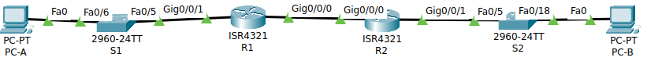
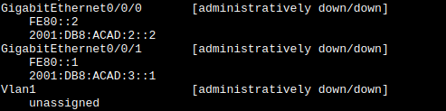
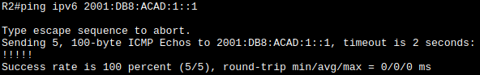
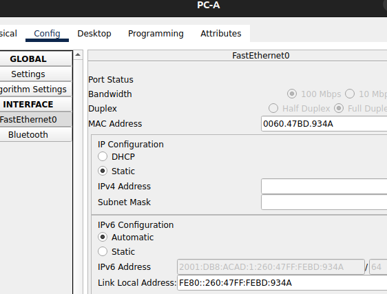
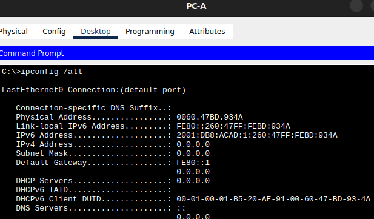
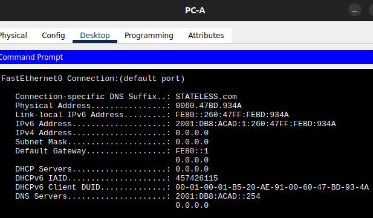

# **Лабораторная работа - Реализация DHCPv6**
## цели
- Часть 1. Создание сети и настройка основных параметров устройства
- Часть 2. Проверка назначения адреса SLAAC от R1
- Часть 3. Настройка и проверка сервера DHCPv6 без гражданства на R1
- Часть 4. Настройка и проверка состояния DHCPv6 сервера на R1
- Часть 5. Настройка и проверка DHCPv6 Relay на R2
## Часть 1. Создание сети и настройка основных параметров устройства
### Шаг 1. создание сети
собираю схему из методички



Адреса интерфейсов

| Устройство | Интерфейс | IPv6 адрес                       |
| ---------- | --------- | -------------------------------- |
| R1         | G/0/0/0   | 2001:db8:acad:2::1/64<br>fe80::1 |
|            | G/0/0/1   | 2001:db8:acad:1::1/64<br>fe80::1 |
| R2         | G/0/0/0   | 2001:db8:acad:2::2/64<br>fe80::2 |
|            | G/0/0/1   | 2001:db8:acad:3::1/64<br>fe80::1 |
| PC-A       | NIC       | DHCP                             |
| PC-B       | NIC       | DHCP                             |
слева `:1`, между роутерами `:2`, справа `:3`
### Шаг 2. настройка хостов
на хостах в любой вкладке выбираю DHCP и IPv6, а тут уже две опции.

### Шаг 3. Первичная настройка коммутаторов и маршрутизаторов.
первично настраиваю имена и адреса для интерфейсов, включаю трансляцию ipv6 и маршрут по умолчанию
**на R1:**
```
enable
conf term
	host R1
	no ip domain-lookup
	inter gi 0/0/0
		ipv6 address fe80::1 link-local
		ipv6 address 2001:db8:acad:2::1/64
		no shutdown
	exit
	inter gi 0/0/1
		ipv6 address fe80::1 link-local
		ipv6 address 2001:db8:acad:1::1/64
		no shutdown
	exit
	ipv6 unicast-routing
	ipv6 route 2001:db8:acad::0/72 gi 0/0/0
exit
copy run start
```
**на R2:**
```
enable
conf term
	host R2
	no ip domain-lookup
	inter gi 0/0/0
		ipv6 address fe80::2 link-local
		ipv6 address 2001:db8:acad:2::2/64
		no shutdown
	exit
	inter gi 0/0/1
		ipv6 address fe80::1 link-local
		ipv6 address 2001:db8:acad:3::1/64
		no shutdown
	exit
	ipv6 unicast-routing
	ipv6 route 2001:db8:acad::0/72 gi 0/0/0
exit
copy run start
```
для самопроверки `show ipv6 interface brief` например на R2:



проверяю работоспособность с R2: `ping ipv6 2001:DB8:acad:1::1`
- Не пингуется.
- `inter vlan1; no shut` Не пингуется.
- `ip routing` Не пингуется.
- настроил маршрутизацию по другому:
```
R2(config)#no ipv6 route 2001:DB8:ACAD::/72
R2(config)#ipv6 route 2001:DB8:ACAD:1::0/64 2001:DB8:ACAD:2::1

R1(config)#no ipv6 route 2001:DB8:ACAD::/72
R1(config)#ipv6 route 2001:DB8:ACAD:3::/64 2001:DB8:ACAD:2::2
```
Теперь пингуется:


- - -
## Часть 2. Проверка назначения адреса SLAAC от R1
Назначаю PC-A автоматическую настройку IPv6


Формируется 2 адреса ipv6 по UEI-64 - в середине FFFE, а вокруг половинки МАК адреса.

Хост использовал только мак, никакой иной информации.
## Часть 3. Настройка и проверка сервера DHCPv6 без гражданства на R1
настраиваю DHCP без состояния 
```
ipv6 dhcp pool R1-STATELESS
	dns-server 2001:db8:acad::254
	domain-name STATELESS.com
exit

interface g0/0/1
	ipv6 nd other-config-flag
	ipv6 dhcp server R1-STATELESS
exit
```
В результате появился адрес днс и суфикс, но адрес генерируется такой же.


- - -
## Часть 4. Настройка и проверка состояния DHCPv6 сервера на R1
теперь создаем полноценный DHCP
```
ipv6 dhcp pool R2-STATEFUL
	address prefix 2001:db8:acad:3:aaa::/80
	dns-server 2001:db8:acad::254
	domain-name STATEFUL.com
exit
```
и подключаю его к интерфейсу.
```
interface g0/0/0
	ipv6 dhcp server R2-STATEFUL
exit
```

- - -
## Часть 5. Настройка и проверка DHCPv6 Relay на R2
```
interface g0/0/1
	ipv6 nd managed-config-flag
	ipv6 dhcp relay destination 2001:db8:acad:2::1 g0/0/0
```
и не удается набрать последнюю команду, нет relay в выборе. Версия Packet tracer 8, роутер 4321, 
```
Cisco IOS XE Software, Version 03.16.05.S - Extended Support Release

Cisco IOS Software, ISR Software (X86_64_LINUX_IOSD-UNIVERSALK9-M), Version Version 15.5 (3)S5, RELEASE SOFTWARE (fc2)
```
В общем переброс DHCP не получается, как наверное и в v4 - я там просто продублировал на R2, нужна помощь.

Но так как я сразу настроил статическую маршрутизацию хосты пингуют друг друга, без проблем.