# Лабораторная работа - Конфигурация безопасности коммутатора
План:
- **[[#Часть 1. Настройка основного сетевого устройства]]**
	- **[[#1.1 Создать сеть]]**
	- **[[#1.2 Настроить маршрутизатор R1]]**
	- **[[#1.3 Настроить и проверить основных параметров коммутаторов]]**
- **[[#Часть 2. Настройка сетей VLAN]]**
	- **[[#2.1 Сконфигруровать VLAN 10]]**
	- **[[#2.2 Cконфигруровать SVI для VLAN 10]]**
	- **[[#2.3 Настроить VLAN 333 с именем Native на S1 и S2]]**
	- **[[#2.4 Настроить VLAN 999 с именем ParkingLot на S1 и S2]]**
- **[[#Часть 3: Настройки безопасности коммутатора]]**
	- **[[#3.1 Реализовать магистральные соединений 802.1Q]]**
	- **[[#3.2 Настроить порты доступа]]**
	- **[[#3.3 Безопасность неиспользуемых портов коммутатора]]**
	- **[[#3.4 Реализовать и документировать функции безопасности порта]]**
	- **[[#3.5 Реализовать безопасность DHCP snooping]]**
	- **[[#3.6 Реализовать PortFast и BPDU Guard]]**
	- **[[#3.7 Проверить сквозную связанности]]**


## Часть 1. Настройка основного сетевого устройства
###  1.1 Создать сеть
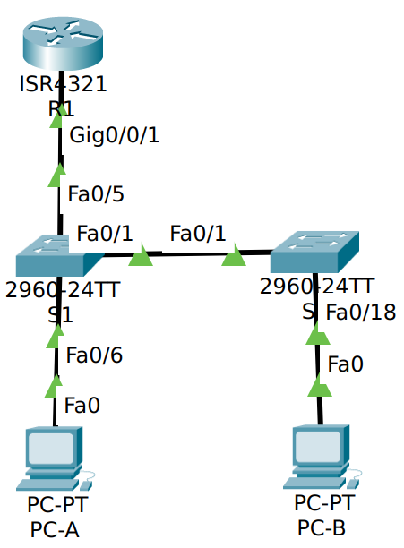

Таблица адресаций

| Устройство | interface/vlan | IP-адрес       | Маска подсети |
| ---------- | -------------- | -------------- | ------------- |
| R1         | G0/0/1         | 192.168.10.1   | 255.255.255.0 |
| R1         | Loopback 0     | 10.10.1.1      | 255.255.255.0 |
| S1         | VLAN 10        | 192.168.10.201 | 255.255.255.0 |
| S2         | VLAN 10        | 192.168.10.202 | 255.255.255.0 |
| PC A       | NIC            | DHCP           | 255.255.255.0 |
| PC B       | NIC            | DHCP           | 255.255.255.0 |
###  1.2 Настроить маршрутизатор R1
Из методички
```
enable
config term
	hostname R1
	service password-encryption
	banner motd x hello, be nice x
	no ip domain-lookup
	
	ip dhcp excluded-address 192.168.10.1 192.168.10.9
	ip dhcp excluded-address 192.168.10.201 192.168.10.202
	ip dhcp relay information trust-all
	ip dhcp pool Students
		network 192.168.10.0 255.255.255.0
		default-router 192.168.10.1
		domain-name CCNA2.Lab-11.6.1
	exit
	
	interface Loopback0
		ip address 10.10.1.1 255.255.255.0
	exit
	
	interface GigabitEthernet0/0/1.10
		description Link to S1
		encapsulation dot1Q 10
		ip address 192.168.10.1 255.255.255.0
		no shutdown
	exit
	
	line con 0
		logging synchronous
		exec-timeout 0 0
	exit
exit

clock set 21:02:00 jan 29 2026
terminal history size 256

copy ru st
```
Проверяю `show ip interface brief`:

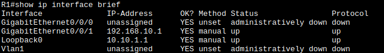
###  1.3 Настроить и проверить основных параметров коммутаторов
```
enable
config term
	hostname S1/2
	service password-encryption
	banner motd x hello, be nice x
	no ip domain-lookup
exit

clock set 21:02:00 jan 29 2026
terminal history size 256

copy ru st
```
##  Часть 2. Настройка сетей VLAN
### 2.1 Сконфигурировать VLAN 10
```
conf t
	vlan 10
		name Management
	exit
```

### 2.2 Cконфигруровать SVI для VLAN 10
```
conf t
	interface vlan 10
		ip address 192.168.10.201/202
	exit
```

### 2.3 Настроить VLAN 333 с именем Native на S1 и S2
```
conf t
	vlan 333
		name Native
	exit
```

### 2.4 Настроить VLAN 999 с именем ParkingLot на S1 и S2
```
conf t
	vlan 999
		name ParkingLot
	exit
```

## Часть 3: Настройки безопасности коммутатора
### 3.1 Реализовать магистральные соединений 802.1Q
### 3.2 Настроить порты доступа
```
conf t
	interface fa 0/1
		switchmode mode trunk
		switchport trunk native vlan 333
	exit
	
	interface fa 0/5 # only S1
		switchmode mode trunk
		switchport trunk native vlan 333
	exit
```
магистраль есть

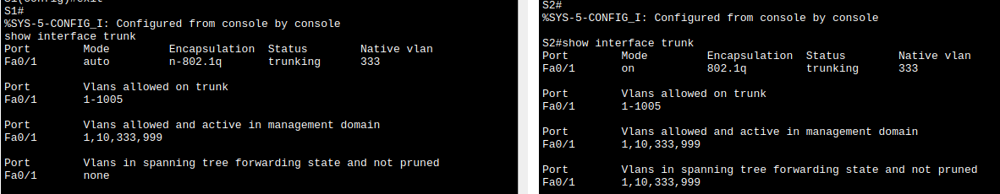

Отключаю DTP:
```
conf t
	interface fa 0/1
		switchport nonegotiate
	exit
```
Получается

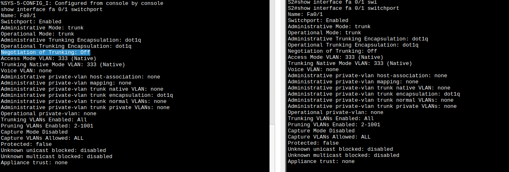
### 3.2 Настроить порты доступа
будет сделана в рамка п 3.4
### 3.3 Безопасность неиспользуемых портов коммутатора
```
conf t
	interface range fa 0/2-24, gi 0/1-2
		switchport mode access
		switch access vlan 999
		shut
	exit
```
Получилось `show interfaces status`

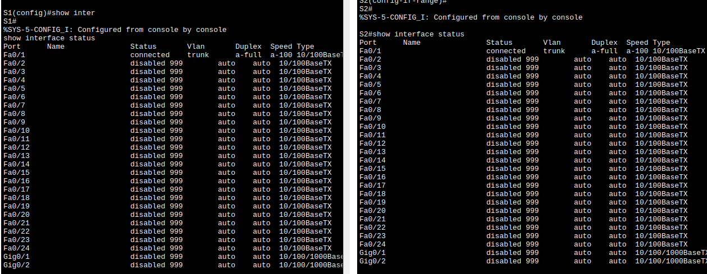
### 3.4 Реализовать и документировать функции безопасности порта
Рассмотрим S1:fa0/6
Конфигурация безопасности порта по умолчанию `show`

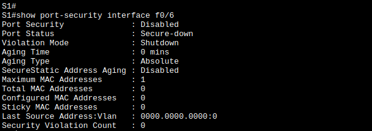

| Функция                                     | Настройка по умолчанию |
| ------------------------------------------- | ---------------------- |
| Защита портов                               | disabled               |
| Максимальное количество записей MAC-адресов | 1                      |
| Режим проверки на нарушение безопасности    |                        |
| Aging Time                                  | 0 mins                 |
| Aging Type                                  | Absolute               |
| Secure Static Address Aging                 | Disabled               |
| Sticky MAC Address                          | 0                      |
Дополнительно придется "распарковать" интерфейс.
```
conf t
	interface fa 0/6
		switch access vlan 10
		switchport port-security aging time 60
		switchport port-security aging type inactive
		switchport port-security maximum 3
		switchport port-security violation restrict
		switchport port-security
		no shut
```

`aging type` не удается настроить, нет такой команды в CPT:

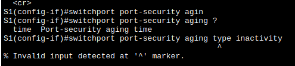

Остальное получилось `show port-security interface fa 0/6`:

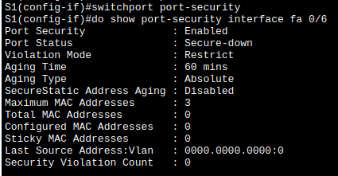

Проверяю таблицу маков `show port-security address`. Запись не появится, пока я не создам какую либо активность со стороны хоста:

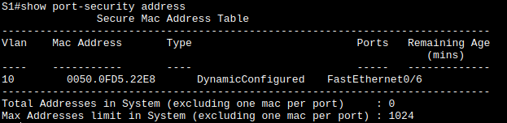

Аналогичные действия для S2:fa0/18:
```
conf t
	interface fa 0/18
		switch access vlan 10
		switchport port-security aging time 60
		switchport port-security maximum 2
		switchport port-security violation protect
		switchport port-security
		no shut
```
И результат. Так же прежде чем появится запись в таблице нужно произвести активность на хосте:

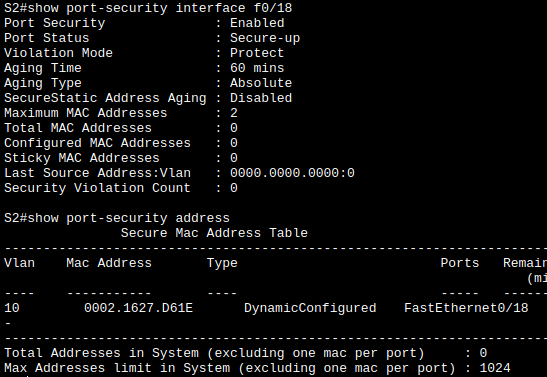

### 3.5 Реализовать безопасность DHCP snooping
Включаю DHCP snooping на S2
```
conf t
	ip dhcp snooping
	ip dhcp snooping vlan 10
```
Настраиваю магистральные порты  S2 как довереные
```
	interface fa 0/1
		ip dhcp snooping trust
	end
```
Ограничиваю ненадежный порт Fa0/18 на S2 пятью DHCP-пакетами в секунду
```
	interface fa 0/18
		ip dhcp snooping limit rate 5
	end
```
Проверяю `show ip dhcp snooping`:

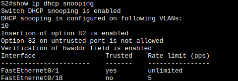

Освобождаю и обновляю IP-адрес на хосте PC-B
Проверяю `show ip dhcp snooping binding`:

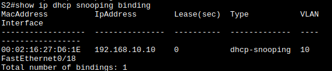

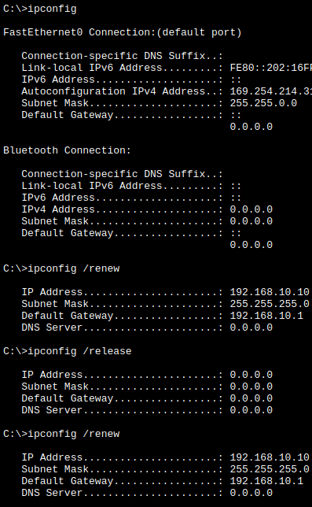
### 3.6 Реализовать PortFast и BPDU Guard
Настраивать надо только порты доступа.
```
conf t
	spanning-tree vlan 10
	spanning-tree portfast bpduguard default
	interface fa 0/6 # 0/18 на S2
		spanning-tree portfast
```
проверяю что получилось
`show running-config | begin spanning-tree` - включен portfast:

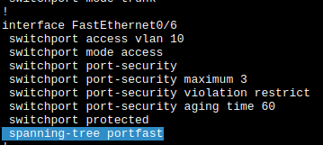

`show spanning-tree summary` - включен BPDU-Guard:

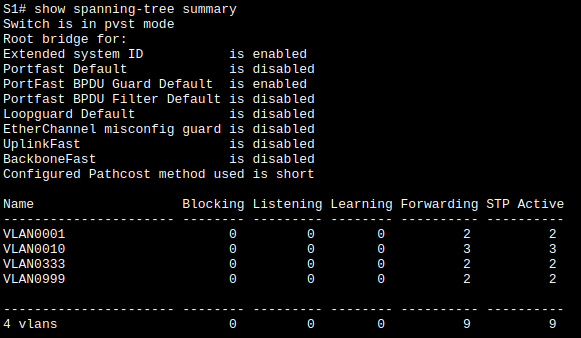

`show spanning-tree interface f0/6 detail` - опять, включен portfast:

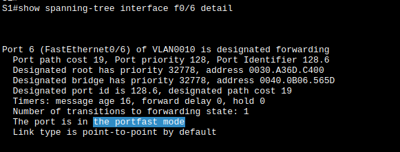

Аналогично для S2
### 3.7 Проверить сквозную связанности
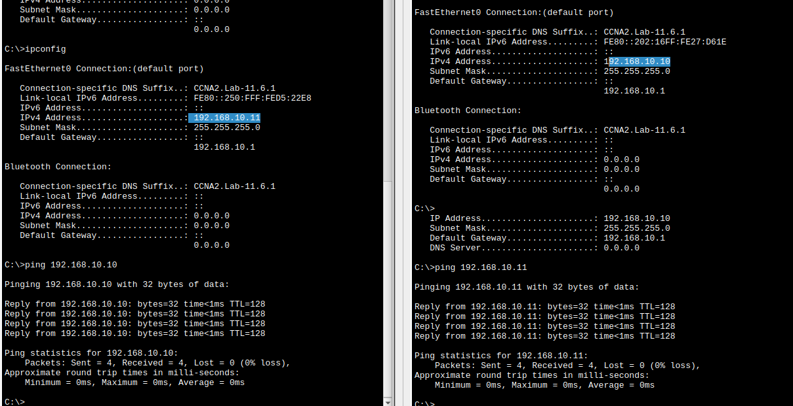
### Вопросы для повторения
- **Q1.** С точки зрения безопасности порта на S2, почему нет значения таймера для оставшегося возраста в минутах, когда было сконфигурировано динамическое обучение - sticky?
	- обучение с залипанием означает, что валидным объявляется первый полученый адрес - предполагается что при нормальной работе хоста он никогда не будет меняться, а значит не протузает. Так же он записывается в конфиг, чтобы нельзя было подменить устройство передернув питание.

- **Q2.** Что касается безопасности порта на S2, если вы загружаете скрипт текущей конфигурации на S2, почему порту 18 на PC-B никогда не получит IP-адрес через DHCP?
	- Перерезагрузил S2, всё нормально
	

- **Q3.** Что касается безопасности порта, в чем разница между типом абсолютного устаревания и типом устаревание по неактивности?
	- **абсолютное устаревание** - адрес порта удаляется по истечению времени.
	- **устаревание по неактивности** - адрес удаляется по истечению времени при неактивности порта.