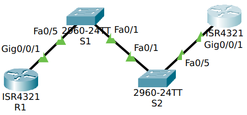
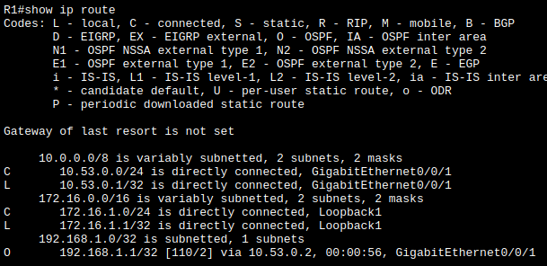
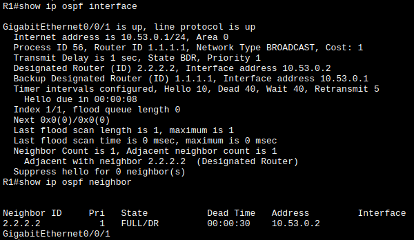
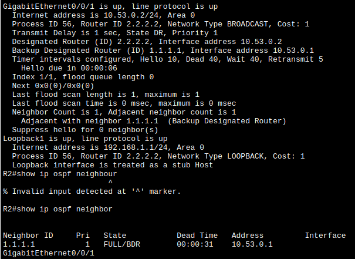
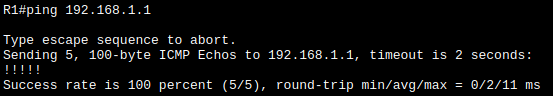
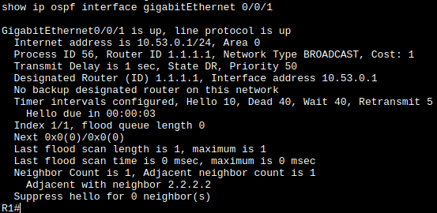
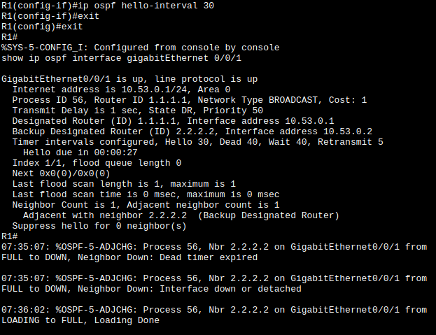
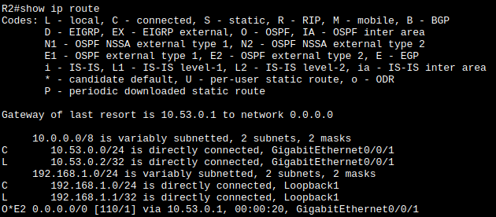
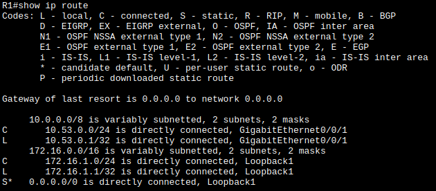

# Лабораторная работа. Настройка протокола OSPFv2 для одной области
## Часть 1. Создание сети и настройка основных параметров устройства
собираю топологию



таблица адресов

| Устройство | Интерфейс | IP-адрес    | Маска подсети |
| ---------- | --------- | ----------- | ------------- |
| R1         | G0/0/1    | 10.53.0.1   | 255.255.255.0 |
| R1         | Loopback1 | 172.16.1.1  | 255.255.255.0 |
| R2         | G0/0/1    | 10.53.0.2   | 255.255.255.0 |
| R2         | Loopback1 | 192.168.1.1 | 255.255.255.0 |
Базовые настройки
```
enable
config terminal
	hostname R1
	no ip domain-lookup
	enable secret class
	line console 0
		password cisco
		login
		exit
	line vty 0 15
		password cisco
		login
		exit
	service password-encryption
	banner motd x hello, be nice x
exit
copy ru st

clock set 12:21:00 jan 17 2026
```
## Часть 2. Настройка и проверка базовой работы протокола OSPFv2 для одной области
Настраиваю интерфейсы интерфейсов
на R1:
```
interface gi 0/0/1
	ip address 10.53.0.1 255.255.255.0
	no shut
exit

interface loopback 1
	ip address 172.16.1.1 255.255.255.0
	no shut
exit
```
на R2:
```
interface gi 0/0/1
	ip address 10.53.0.2 255.255.255.0
	no shut
exit

interface loopback 1
	ip address 192.168.1.1 255.255.255.0
	no shut
exit
```
Настраиваю с OSPF
На R1
```
router ospf 56
	router-id 1.1.1.1
exit

interface gi 0/0/1
	ip ospf 56 area 0
exit

```
На R2 
```
router ospf 56
	router-id 2.2.2.2
exit

interface gi 0/0/1
	ip ospf 56 area 0
exit

interface loopback 1
	ip ospf 56 area 0
exit
```
Проверяю связности
`show ip route` на R1 появилась сеть с R2



Отвечаю на каверзные вопросы
проверяю параметры `ip ospf interface` и `ip ospf neighbor`





Значит - R1 - BDR, R2 - DR, что согласуется с правилами выбора - у кого айдишник больше, тот и DR.

пинг до сети работает:



## Часть 3. Оптимизация и проверка конфигурации OSPFv2 для одной области
### Шаг1. Оптимизации
- меняю приоритет на R1
```
interface gi 0/0/1
	ip ospf priority 50
end

clear ip ospf process
```
теперь роли поменялись



- настраиваю таймеры 
```
interface gi 0/0/1
	ip ospf hello-interval 30
exit
```
в процессе соседство разорвалось, изза несогласованности параметров, потом восстановилось



на R1:
```
ip route 0.0.0.0 0.0.0.0 loopback 1
*%Default route without gateway, if not a point-to-point interface, may impact performance*

router ospf 56
	default-information originate
exit
```

спустя несколько мгновений в R2 обновляется таблица маршрутизации



Теперь убираю loopback из ospf на R2
```
interface lo 1
	no ip ospf 56 area 0
exit
```



Настраиваю R2:lo 1 как точка-точка:
`ip ospf network point-to-point`

Устанавливаю базовую пропускную способность и обновляю соседство на обоих маршрутизаторах:
```
interface gi 0/0/1
	bandwidth 10000000000
end

clear ip ospf process 
```
### Шаг 2. проверяю
и в итоге я чегото сделал не правильно, потому что у меня несоответствие пунктам а - дедтайм остался 40 - он автоматически не пересчитывается?
и b - на R1 нет OSPF путей.
ой всё. Всё сломалось короче, я не понимаю.