# Лабораторная работа. Настройка и проверка расширенных списков контроля доступа

## Часть 1. Создание сети и настройка основных параметров устройства
### Шаг 1. Создание сети
собрал схему

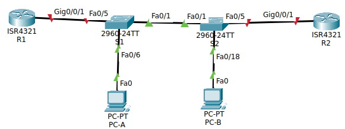

таблицы адресов и сетей

| устройство | Интерфейс   | Маска      | Подсети       | Шлюз по умолчанию |
| ---------- | ----------- | ---------- | ------------- | ----------------- |
| R1         | G0/0/1      | —          | —             | —                 |
| R1         | G0/0/1.20   | 10.20.0.1  | 255.255.255.0 | —                 |
| R1         | G0/0/1.30   | 10.30.0.1  | 255.255.255.0 | —                 |
| R1         | G0/0/1.40   | 10.40.0.1  | 255.255.255.0 | —                 |
| R1         | G0/0/1.1000 | —          | —             | —                 |
| R1         | Loopback1   | 172.16.1.1 | 255.255.255.0 | —                 |
| R2         | G0/0/1      | 10.20.0.4  | 255.255.255.0 | —                 |
| S1         | VLAN 20     | 10.20.0.2  | 255.255.255.0 | 10.20.0.1         |
| S2         | VLAN 20     | 10.20.0.3  | 255.255.255.0 | 10.20.0.1         |
| PC-A       | NIC         | 10.30.0.10 | 255.255.255.0 | 10.30.0.1         |
| PC-B       | NIC         | 10.40.0.10 | 255.255.255.0 | 10.40.0.1         |
  
| VLAN | Имя         | Назначенный интерфейс                                                    |
| ---- | ----------- | ------------------------------------------------------------------------ |
| 20   | Management  | S2: F0/5                                                                 |
| 30   | Operations  | S1: F0/6                                                                 |
| 40   | Sales       | S2: F0/18                                                                |
| 999  | ParkingLot  | S1: F0/2-4, F0/7-24, G0/1-2<br><br>S2: F0/2-4, F0/6-17, F0/19-24, G0/1-2 |
| 1000 | Собственная | —                                                                        |
|      |             |                                                                          |
### Шаг 2, 3. первичная настройка коммутаторов и маршрутизаторов 
пароли и названия.
```
enable
conf term
	hostname S1
	no ip domain-lookup
	enable secret class

	line console 0
		password cisco
		login
	exit

	line vty 0 15
		password cisco
		login
	exit

	service password-encryption
	banner motd x hello, be nice x
	ip routing #сработает только на маршрутизаторах
exit

clock set 09:38:00 jan 16 2026
terminal history size 256

copy ru st
```
## Часть 2. Настройка сетей VLAN на коммутаторах.
### Шаг 1. Создание сетей VLAN на коммутаторах.
#### a. Создаю vlan и именую их 
на S1 и на S2
```
vlan 20
	name Management
exit

vlan 30
	name Operations
exit

vlan 40
	name Sales
exit

vlan 999
	name Parking_Lot
exit

vlan 1000
	name native
exit
```
#### b. Настраиваю адреса интерфейса и шлюз по умолчанию на каждом коммутаторе.
Согласно таблице адресов
на S1
```
interface vlan 20
	 ip address 10.20.0.2 255.255.255.0
	 no shut
exit
ip default-gateway 10.20.0.1
```
 на S2
```
interface vlan 20
	 ip address 10.20.0.3 255.255.255.0
	 no shut
exit
ip default-gateway 10.20.0.1
```
#### с. Паркую неиспользованые порты коммутаторов
На S1:
```
interface range fa0/2-4, fa0/7-24, gi0/1-2
	switchport mode access
	switchport access vlan 999
	shut
exit
```
На S2:
```
interface range fa0/2-4, fa0/6-17, fa0/19-24, gi0/1-2
	switchport mode access
	switchport access vlan 999
	shut
exit
```
### Шаг 2. Назначение сетей VLAN соответствующим интерфейсам коммутатора. 

 Сопоставление виртуальных сетей к интерфейсам
 на S1:
 ```
interface fa 0/6
	switchport mode access
	switchport access vlan 30
	no shut
exit
 ```
 на S2:
```
interface fa 0/18
	switchport mode access
	switchport access vlan 40
	no shut
exit

interface fa 0/5
	switchport mode access
	switchport access vlan 20
	no shut
exit
```
Проверяю результаты `show vlan brief`:

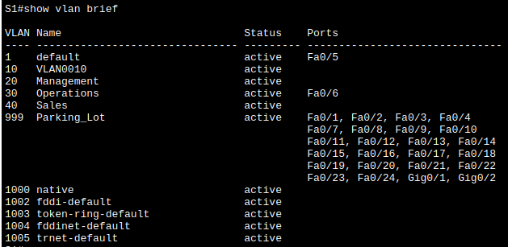

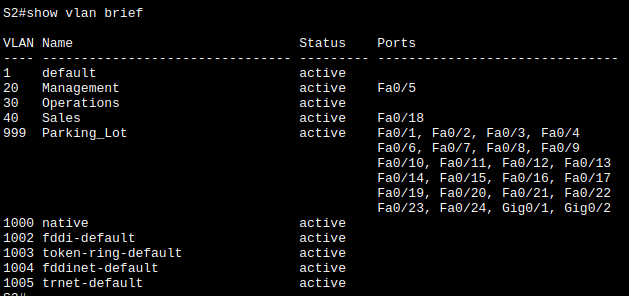
## Часть 3. Настройка магистралей.
### Шаг 1. Настройка интерфейсов Fa 0/1
На S1 и S2
```
interface fa 0/1
	switchport mode trunk
	switchport trunk native vlan 1000
	switchport trunk allowed vlan 20,30,40,1000
	no shut
exit
```
Проверяю результаты `show interfaces trunk`:

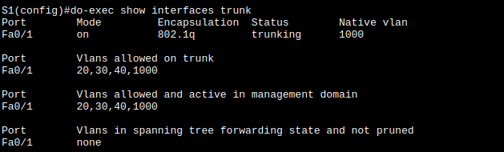

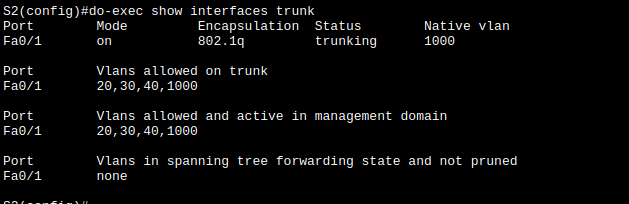
### Шаг2. Настройка интерфейса Fa 0/5
На S1:
```
interface fa0/5
	switchport mode trunk
	switchport trunk native vlan 1000
	switchport trunk allowed vlan 20,30,40,1000
	no shut
end
copy ru st
```
Проверяю результаты `show interfaces trunk`: изменений не видно, посмотрю после того, как подниму vlan на R1 
## Часть 4. Настройка маршрутизации.
### Шаг 1. Настройка маршрутизации между сетями VLAN на R1
 на R1:
```
interface gi 0/0/1.20
	encapsulation dot1Q 20
	ip address 10.20.0.1 255.255.255.0
	description Net Management VLAN
	no shut
exit

interface gi 0/0/1.30
	encapsulation dot1Q 30
	description Operations VLAN
	ip address 10.30.0.1 255.255.255.0
	no shut
exit

interface gi 0/0/1.40
	encapsulation dot1Q 40
	description Sales VLAN
	ip address 10.40.0.1 255.255.255.0
	no shut
exit

interface gi 0/0/1.1000
	encapsulation dot1Q 1000 native
	description Native VLAN
	no ip address
	no shut
exit

interface gi 0/0/1
	no shut
exit

interface lo 1
	ip address 172.16.1.1 255.255.255.0
	no shut
exit
```

Проверяю `show ip interface brief`:

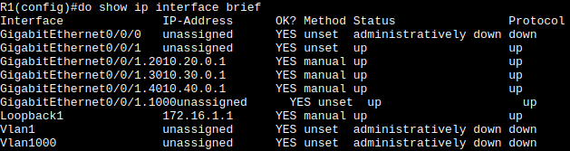

Перепроверяю на S1 `show interfaces trunk`:

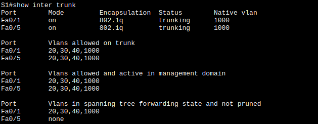
## Шаг 2. Настройка R2 g0/0/1
с использованием адреса из таблицы и маршрута по умолчанию с адресом следующего перехода 10.20.0.1
R2:
```
interface gi 0/0/1
	ip address 10.20.0.4 255.255.255.0
	no shut
exit
```
Проверяю `show ip interface brief`:
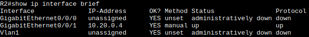
- - - - -
## Часть 5. Настройка удаленного доступа.

### Шаг 1. Настройка всех сетевых устройств для базовой поддержки SSH.
```
# Проверьте или создайте запись локальной базы данных. Создайте учетную запись
пользователя в локальной базе данных с помощью команд
username SSHadmin privilege 15 secret $cisco123!
ip domain-name ccna-lab.com
crypto key generate rsa general-keys modulus 1024
line vty 0 4
	transport input ssh
exit
```
Проверяю подключение из R2:
<<<<<<<<<<<<<<<<<<<<<< 
### Шаг 2. Включить защищенные веб-службы с проверкой подлинности на R1
На R1:
```
ip http secure-server
ip http authentication local
```
Опять говорит нету команд таких.
- `no aaa new-model`  -> no change
- `aaa new-model` -> no change

## Настройте удаленный доступ
## Часть 6. Проверка подключения
### Шаг 1. Настройка узлов ПК
по таблице адресов
### Шаг 2. Проверка подключения
попытки "зайти на сайт маршрутизатора" 
либо сообщение "Request Timeout" через несколько секунд - принимаю это сообщение за неудачу
либо "Server Reset Connection". принимаю это сообщение за успех

| От   | Протокол | Назначение | Результат |
| ---- | -------- | ---------- | --------- |
| PC-A | Ping     | 10.40.0.10 | OK        |
| PC-A | Ping     | 10.20.0.1  | OK        |
| PC-B | Ping     | 10.30.0.10 | OK        |
| PC-B | Ping     | 10.20.0.1  | OK        |
| PC-B | Ping     | 172.16.1.1 | OK        |
| PC-B | HTTPS    | 10.20.0.1  | OK        |
| PC-B | HTTPS    | 172.16.1.1 | OK        |
| PC-B | SSH      | 10.20.0.1  | OK        |
| PC-B | SSH      | 172.16.1.1 | OK        |
## Часть 7. Настройка и проверка списков контроля доступа (ACL)

### Шаг 1. Настройка политик
- **Политика**1. Сеть Sales не может использовать SSH в сети Management (но в другие сети SSH разрешен).
- **Политика 2a**. Сеть Sales не имеет доступа к IP-адресам в сети Management с помощью любого веб-протокола (HTTP/HTTPS).
- **Политика 2b**. Сеть Sales также не имеет доступа к интерфейсам R1 с помощью любого веб-протокола. Разрешён весь другой веб-трафик (обратите внимание — Сеть Sales может получить доступ к интерфейсу Loopback 1 на R1).
- **Политика**3. Сеть Sales не может отправлять эхо-запросы ICMP в сети Operations или Management. Разрешены эхо-запросы ICMP к другим адресатам.
- **Политика 4**: Cеть Operations не может отправлять ICMP эхозапросы в сеть Sales. Разрешены эхо-запросы ICMP к другим адресатам.
Резюмирую

| От         | До            | Протокол   | правило   | #     | Политика  |
| ---------- | ------------- | ---------- | --------- | ----- | --------- |
| Sales      | Management    | SSH        | Запрет    | 11    | SALES_POL |
| Sales      | Others        | SSH        | Разрешено | 100   | SALES_POL |
| Sales      | Management    | HTTP/HTTPS | Запрет    | 21,22 | SALES_POL |
| Sales      | интерфейсы R1 | HTTP/HTTPS | Запрет    | 23-28 | SALES_POL |
| Sales      | Others (lo 1) | HTTP/HTTPS | Разрешено | 100   | SALES_POL |
| Sales      | Management    | ICMP       | Запрет    | 31    | SALES_POL |
| Sales      | Operations    | ICMP       | Запрет    | 32    | SALES_POL |
| Sales      | Others        | ICMP       | Разрешено | 100   | SALES_POL |
| Operations | Sales         | ICMP       | Запрет    | 41    | OPER_POL  |
| Operations | Others        | ICMP       | Разрешено | 100   | OPER_POL  |
|            |               |            |           |       |           |
Оба на R1:
```
ip access-list extended SALES_POL
	remark Policy 1
	11 deny tcp any 10.20.0.0 0.0.0.255 range 22 23
	
	remark Policy 2a
	21 deny tcp any 10.20.0.0 0.0.0.255 eq www
	22 deny tcp any 10.20.0.0 0.0.0.255 eq 443
	
	remark Policy 2b
	23 deny tcp any host 10.20.0.1 eq www
	24 deny tcp any host 10.20.0.1 eq 443
	25 deny tcp any host 10.30.0.1 eq www
	26 deny tcp any host 10.30.0.1 eq 443
	27 deny tcp any host 10.40.0.1 eq www
	28 deny tcp any host 10.40.0.1 eq 443
	
	remark Policy 3
	31 deny icmp any 10.20.0.0 0.0.0.255
	32 deny icmp any 10.30.0.0 0.0.0.255
		
	remark default
	100 permit ip any any
exit

ip access-list extended OPER_POL
	remark Policy 4
	41 deny icmp any 10.40.0.0 0.0.0.255
		
	remark default
	100 permit ip any any
exit
```
устанавливаю списки на интерфейсы: SALES_POL - исходящий из 40 VLAN
OPER_POL - исходящий из 30 VLAN
```
interface gi 0/0/1.40
	ip access-group SALES_POL in
exit

interface gi 0/0/1.30
	ip access-group OPER_POL in
exit
```
`show access-lists`

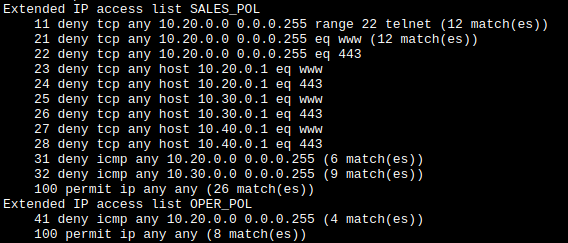
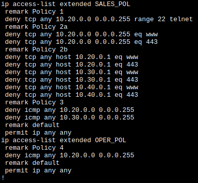
### Шаг 2. Проверка работы политик

| От   | Протокол | Назначение | Результат          |
| ---- | -------- | ---------- | ------------------ |
| PC-A | Ping     | 10.40.0.10 | FAIL               |
| PC-A | Ping     | 10.20.0.1  | unreachable?<br>OK |
| PC-B | Ping     | 10.30.0.10 | FAIL               |
| PC-B | Ping     | 10.20.0.1  | FAIL               |
| PC-B | Ping     | 172.16.1.1 | OK                 |
| PC-B | HTTPS    | 10.20.0.1  | FAIL               |
| PC-B | HTTPS    | 172.16.1.1 | OK                 |
| PC-B | SSH      | 10.20.0.1  | FAIL               |
| PC-B | SSH      | 172.16.1.1 | OK                 |
Почти всё работает, только 2я строка не сработала. Отлаживаюсь
`clear access-list counters`
пингую - смотрю - не ту сеть заблочил для пингования, переписываю OPER_POL и выясняю, что срабатывает правило 41
`41 deny icmp any 10.20.0.0 0.0.0.255` - подсеть не та.
Меняю правило
```
ip access-list extended OPER_POL
	no 41
	41 deny icmp any 10.40.0.0 0.0.0.255
exit
```
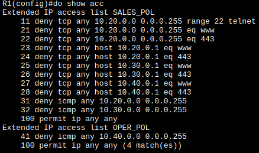

И теперь всё работает, как и требовалось.