# Лабораторная работа. Настройка NAT для IPv4

Содержание:
- **Часть 1**. Создание сети и настройка основных параметров устройства
- **Часть 2**. Настройка и проверка NAT для IPv4.
- **Часть 3**. Настройка и проверка PAT для IPv4.
- **Часть 4**. Настройка и проверка статического NAT для IPv4.
## Часть 1. Создание сети и настройка основных параметров устройства
- Собрал схему
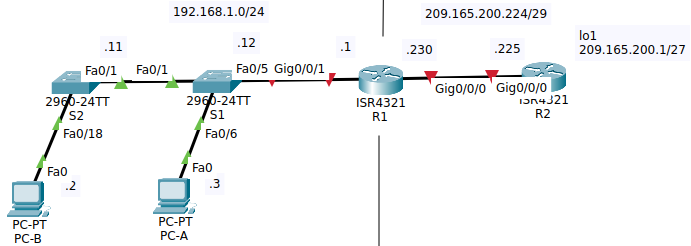
- Настроил маршрутизаторы
На R1:
```
enable
config term
	hostname R1
	service password-encryption
	banner motd x hello, be nice x
	no ip domain-lookup
	
	line console 0
		password cisco
		login
	exit

	line vty 0 15
		password cisco
		login
	exit

	ip routing
	ip route 0.0.0.0 0.0.0.0 gi 0/0/0
	
	interface gi 0/0/0
		ip address 209.165.200.230 255.255.255.248
		no shut
	exit
	
	interface gi 0/0/1
		ip address 192.168.1.1 255.255.255.0
		no shut
	exit
exit

clock set 13:48:00 jan 19 2026
terminal history size 256

copy ru st
```
На R2:
```
enable
config term
	hostname R2
	service password-encryption
	banner motd x hello, be nice x
	no ip domain-lookup
	
	line console 0
		password cisco
		login
	exit

	line vty 0 15
		password cisco
		login
	exit

	ip routing
	
	interface gi 0/0/0
		ip address 209.165.200.225 255.255.255.248
		no shut
	exit
	
	interface lo 1
		ip address 209.165.200.1 255.255.255.224
		no shut
	exit
exit

clock set 13:48:00 jan 19 2026
terminal history size 256

copy ru st
```
- Настроил коммутаторы
На S1:
```
enable
config term
	hostname S1
	service password-encryption
	banner motd x hello, be nice x
	no ip domain-lookup
	
	line console 0
		password cisco
		login
	exit

	line vty 0 15
		password cisco
		login
	exit
	
	interface vlan 1
		ip address 192.168.1.11 255.255.255.0
		no shut
	exit
	
	ip default-gateway 192.168.1.1
exit

clock set 13:48:00 jan 19 2026
terminal history size 256

copy ru st
```
На S2:
```
enable
config term
	hostname S2
	service password-encryption
	banner motd x hello, be nice x
	no ip domain-lookup
	
	line console 0
		password cisco
		login
	exit

	line vty 0 15
		password cisco
		login
	exit
	
	interface vlan 1
		ip address 192.168.1.12 255.255.255.0
		no shut
	exit
	
	ip default-gateway 192.168.1.1
exit

clock set 13:48:00 jan 19 2026
terminal history size 256

copy ru st
```
- Настроил хосты
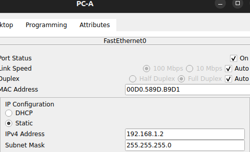

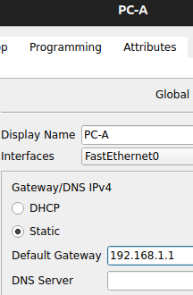

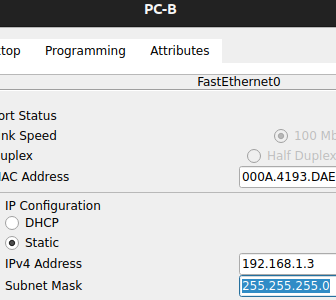

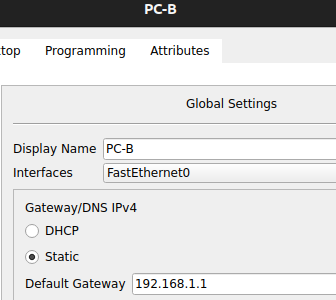

Дошли до состояния, что внутренняя сеть пингуется, сеть провайдера пингуется, даже интерфейс маршрутизатора на стороне сети провайдера пингуется, но R2 не пингуется.
## Часть 2. Настройка и проверка NAT для IPv4

### Шаг 1. Настройка NAT на R1
Использую пул из трех адресов 209.165.200.226-209.165.200.228

```
access-list 1 permit 192.168.1.0 0.0.0.255
ip nat pool PUBLIC_ACCESS 209.165.200.226 209.165.200.228 netmask 255.255.255.248 
ip nat inside source list 1 pool PUBLIC_ACCESS 

interface g0/0/1
	ip nat inside
exit
interface g0/0/0
	ip nat outside
exit
```
### Шаг 2. Проверка NAT

|     | пингую lo1 | `show ip nat translations` |
| --- | ---------- | -------------------------- |
| a   | c PC-A     | 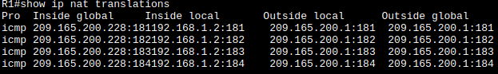               |
| b   | c PC-B     | 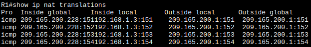               |
| c   | c S1       | 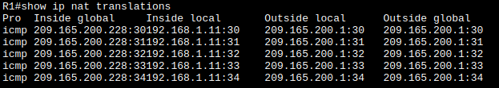               |
| d   | c S2       | <br>           |
В последнем случае должна была произойти неудача, но вопреки описанию в методичке сопоставления NAT не задерживаются надолго в таблице. Команды `show ip nat translations verbose` и `clear ip nat statistics` не срабатывают в пакеттрейсере.
Косвено в режиме симуляции я одновременно послал с 4х устройств пинг- запросы и получил такую картину - 3е пингуют, один нет

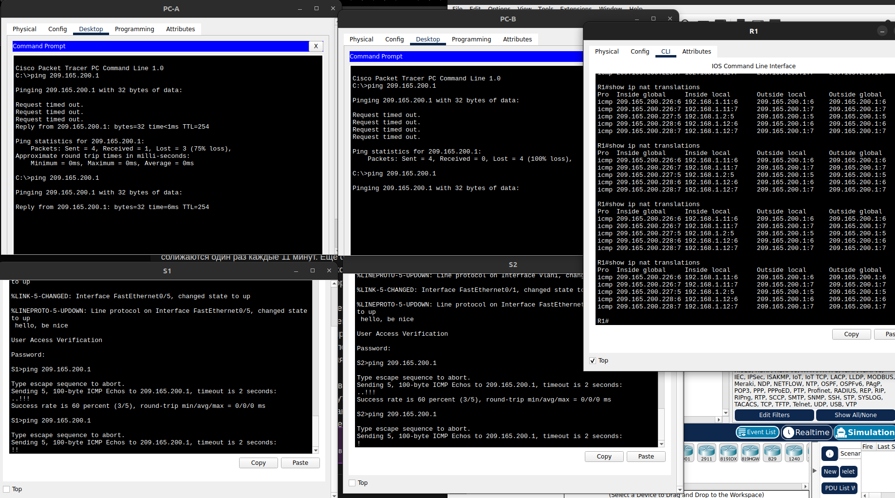
- Q1: Во что был транслирован внутренний локальный адрес PC-B?
	 - В один из адресов пула:  209.165.200.228
- Q2: Какой тип адреса NAT является переведенным адресом?
	- динамический NAT - при неиспользовании сопоставление пропадает.
`show ip nat translations verbose`
- Q3: на сколько выделили адреса?
	- без понятия, команда не работает
- - - 
## Часть 3. Настройка и проверка PAT для IPv4
### Шаг 1-2. Настройка PAT на R1
Очищаю нат преобразования и статистику, удаляю старые настройки NAT и создаю PAT
```
clear ip nat translations *
clear ip nat statistics

conf t
	no ip nat inside source list 1 pool PUBLIC_ACCESS

	ip nat inside source list 1 pool PUBLIC_ACCESS overload
exit
```
### Шаг 1-2. Проверка PAT
#### a. Пингую с PC-A
`show ip nat translations`

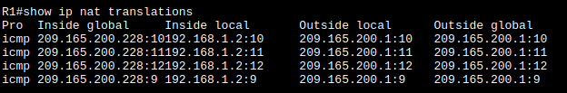
#### b. Пингую с PC-B
`show ip nat translations`

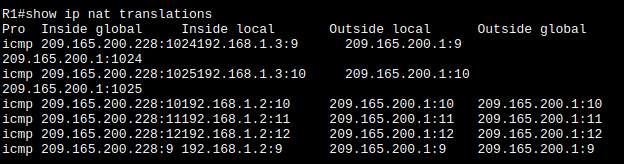

есть только одна запись в таблице трансляций.
повторяю пинг и посмотрю подробности
`show ip nat translations verbose`
Команда не работает.
#### c. Генерирую траффик с нескольких устройств
на PC-A и PC-B:
`ping -t 209.165.200.1`
Проверяю результат на R1:
`show ip nat translations`

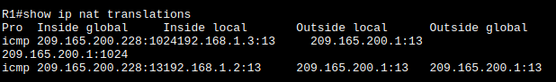

Адрес везде один и тот же
- Q4: Во что был транслирован внутренний локальный адрес PC-B?
	- в 209.165.200.228
- Q5: Какой тип адреса NAT является переведенным адресом?
	- PAT  - адрес общий для всех источников, но порты меняются.  
- Q6: Чем отличаются выходные данные команды **show ip nat translations** из упражнения NAT?
	- сейчас используется только первый адрес из пула, до тех пор, пока хватает портов я предполагаю.
- - - 
### Шаг 4-5. Настройка NAT на интерфейс R1
Очищаю нат преобразования и статистику, удаляю старые настройки и создаю NAT на интерфейс:
```
clear ip nat translations *
clear ip nat statistics

conf t
	no ip nat inside source list 1 pool PUBLIC_ACCESS overload 
	no ip nat pool PUBLIC_ACCESS
	
	ip nat inside source list 1 interface g0/0/0 overload
exit
```
### Шаг 6. Проверка NAT на интерфейс R1
#### a. Пингую с PC-B
`show ip nat translations`

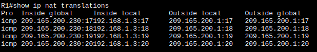
#### a. Генерирую траффик с нескольких устройств
на PC-A и PC-B:
`ping -t 209.165.200.1`
на S1 и S2:
`exec ping 209.165.200.1 repeat 20000`
не работает, приходится обычным пингом пользоваться
Проверяю результат на R1:
`show ip nat translations`

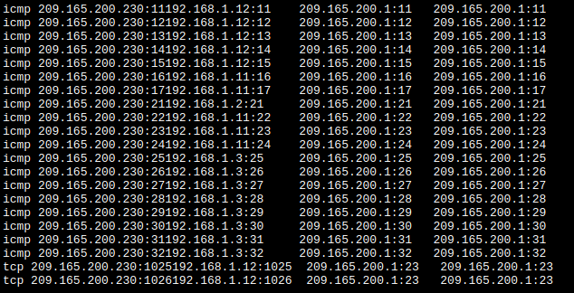

Адрес у всех адрес интерфейса R1:G0/0/0, порт как у запроса по возможности, но может быть изменен:


## Часть 4. Настройка и проверка статического NAT для IPv4
### Шаг 1-2. Настройка статического NAT
Очищаю нат преобразования и статистику, удаляю старые настройки и настраиваю статический NAT
```
clear ip nat translations *
clear ip nat statistics

conf t
	ip nat inside source static 192.168.1.2 209.165.200.229 
end
```

### Шаг 1-2.Проверка статического NAT
`show ip nat translations`

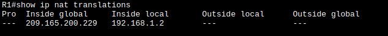

Наконецто увидел строчку привязки, ранее не наблюдалась
На R2 пингую PC-A:

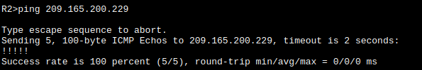

В итоге по этому статическому адресу достучались до внутреннего узла.

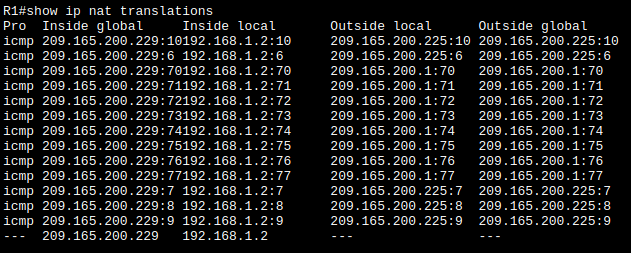