# Лабораторная работа. Настройка NAT для IPv4

Содержание:
- **Часть 1**. Создание сети и настройка основных параметров устройства
- **Часть 2**. Обнаружение сетевых ресурсов с помощью протокола CDP
- **Часть 3**. Обнаружение сетевых ресурсов с помощью протокола LLDP
- **Часть 4**.  Настройка и проверка NTP
## Часть 1. Создание сети и настройка основных параметров устройства
- Собрал схему


- настроил интерфейсы
На R1:
```
enable
config term
	hostname R1
	service password-encryption
	banner motd x hello, be nice x
	no ip domain-lookup
	
	line console 0
		password cisco
		login
	exit

	line vty 0 15
		password cisco
		login
	exit

	ip routing
		
	interface gi 0/0/1
		ip address 10.22.0.1 255.255.255.0
		no shut
	exit
	
	interface lo 1
		ip address 172.16.1.1 255.255.255.0
		no shut
	exit
exit

clock set 11:18:00 jan 20 2026
terminal history size 256

copy ru st
```
На S1:
```
enable
config term
	hostname S1
	service password-encryption
	banner motd x hello, be nice x
	no ip domain-lookup
	
	line console 0
		password cisco
		login
	exit

	line vty 0 15
		password cisco
		login
	exit

	ip default-gateway 10.22.0.1
	
	interface range fa 0/2-4, fa0/6-18, gi0/1-2
		shut
	exit
exit

clock set 11:18:00 jan 20 2026
terminal history size 256

copy ru st
```
На S2:
```
enable
config term
	hostname S2
	service password-encryption
	banner motd x hello, be nice x
	no ip domain-lookup
	
	line console 0
		password cisco
		login
	exit

	line vty 0 15
		password cisco
		login
	exit
	
	ip default-gateway 10.22.0.1
	
	interface range fa 0/2-18, gi0/1-2
		shut
	exit
exit

clock set 11:18:00 jan 20 2026
terminal history size 256

copy ru st
```

| Устройство | Интерфейс  | IP-адрес   | Маска подсети | Шлюз по умолчанию |
| ---------- | ---------- | ---------- | ------------- | ----------------- |
| R1         | Loopback1  | 172.16.1.1 | 255.255.255.0 | —                 |
| R1         | G0/0/1     | 10.22.0.1  | 255.255.255.0 | —                 |
| S1         | SVI VLAN 1 | 10.22.0.2  | 255.255.255.0 | 10.22.0.1         |
| S2         | SVI VLAN 1 | 10.22.0.3  | 255.255.255.0 | 10.22.0.1         |
## Часть 2. Обнаружение сетевых ресурсов с помощью протокола CDP
### Шаг 1. Мониторинг CDP
**a.** На R1:
`show cdp` - нет информации, про интерфейсы

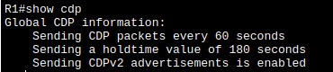

`show cdp neighbours` - в объявлениях участвует один интерфейс gi 0/0/1

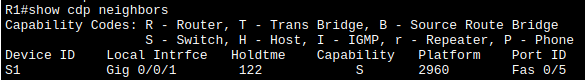

`show cdp interfaces` - аналогично, остальные интерфейсы выключены

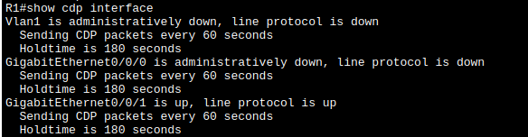
- Q1: Сколько интерфейсов участвует в объявлениях CDP? Какие из них активны?
	- Участвует три инетрфейса, при этом активный только один - gi 0/0/1
**b.** `show cdp entry S1`:

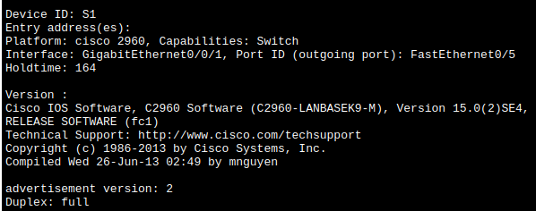
- Q2: какая версия IOS на S1?
	- Version 15.0(2)SE4
**c.** На S1:
`show cdp traffic`:

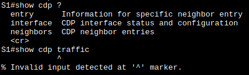

- Q2: Сколько пакето CDP было выдано?
	- не известно, в CPT такой команды не получилось
### Шаг 2. Внесение и фиксация зменений
**d.** Теперь настроим VLAN1
на S1:
```
interface vlan 1
	ip address 10.22.0.2 255.255.255.0
	no shut
exit
```
и на S2:
```
interface vlan 1
	ip address 10.22.0.3 255.255.255.0
	no shut
exit
```
**e.** Повторяю `show cdp entry S1` и сравниваю с предыдущим результатом

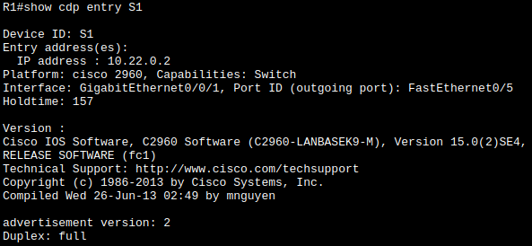

- Q2: Какие новые сведения доступны теперь?
	- Появляется Entry address для коммутатора.
### Шаг 3. Сброс CDP
**f.** Теперь отключаю CDP глобально на всех устройствах:
```
conf t
	no cdp run
exit
```
## Часть 3. Обнаружение сетевых ресурсов с помощью протокола LLDP
**a.** Включаю LLDP:
```
conf t
	lldp run
exit
```
**b.** На S1 смотрю результат:
`show lldp entry S2` - нет такой команды в CPT

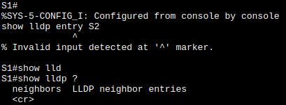

- Q3: Что такое chassis ID для коммутатора S2?
	- уникальный идентификатор узла, по умолчанию используется MAC интерфейса управления.
**c.** Пытаюсь воспроизвести сеть по выводам протокола lldp:

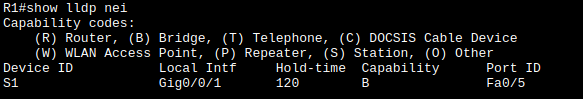
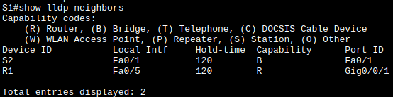
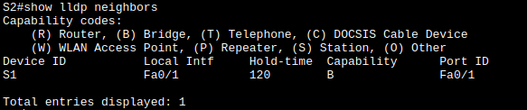

Откуда сопоставляю соседства и интерфесы, получаю, что:
- R1: Gi/0/0/1 -- S1:Fa0/5
- S1:Fa0/1 -- S2:Fa0/1
Что соответствует изначально построенной топологии.
## Часть 4. Настройка и проверка NTP
- Шаг1. Вывожу время на R1:
`show clock`
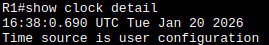
- Шаг2. Устанавливаю время на R1: `clock <tab> ...`:

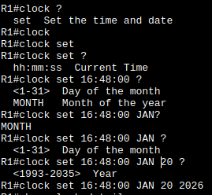
- Шаг3. Настраиваю главный сервер NTP на R1:
```
conf t
	ntp master 4
	ntp server 172.16.1.1
exit
```
- Шаг4. Вывожу время на S1 и S2:

| 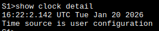 | 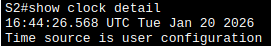 |
| ----------- | ----------- |
теперь настраиваю на них ntp клиентов:
```
ntp server 10.22.0.1
```
И ничего не изменилось.
Однако через час время синхронизировалось по R1:

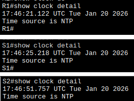

- Q4: Для каких интерфейсов в пределах сети не следует использовать протоколы обнаружения сетевых ресурсов? 
	- Для интерфейсов оконечных устройств - хостов - для них и так всё понятно - это "тупики" с точки зрения поиска возможной коммутации.