Проект эмулирует развитие сети с нуля от небольшой конторы из 3 человек в компанию до 100 человек. В первой части сети изначально не было и всё создавалось с нуля. Так же был сделан кусочек для эмулирования WAN. Во второй части добавляется SSH и DHCP. В третьей части настраиваю etherchannel и придумываю проблему, чтобы воспользоваться CDP. В четвертой части дублирую шлюз и делаю избыточные линки между коммутаторами, чтобы показать работу с STP. В пятой части перенастраиваю всю сеть, чтобы разделить департаменты на разные vlan.

# часть1
Небольшой коллектив, строим сеть с нуля
- ~~настроить ОSPF для эмуляции WAN~~
- создать сеть для офиса на 3х человек.
- настроить днс
- запретить telnet трафик от пользователей - только от админа.
В итоге пришлось упростить схему чтобы продолжить. Теперь интернет это один коммутатор, никак не настроеный.

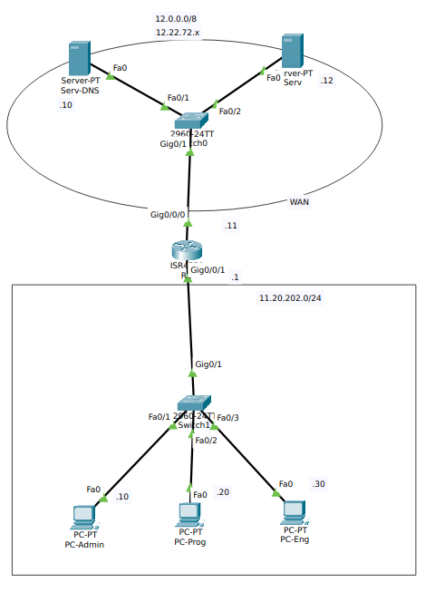


## реализация
Настройка R1:
``` R1
enable
config term
	hostname BG-A
	service password-encryption
	banner motd x hello, be nice x
	no ip domain-lookup
	
	line console 0
		password cisco
		login
	exit

	username admin privilege 15 secret admin
	line vty 0 15
		transport input all
		password cisco
		login
		login local
	exit

	interface gi 0/0/0
		ip address 11.20.202.1 255.255.255.0
		no shut
	exit

	interface gi 0/0/1
		ip address 12.22.72.11   255.0.0.0
		no shut
	exit

	ip routing
	
	ip access-list extended Sec
		30 permit tcp host 11.20.202.10 any any
		31 deny tcp any any range 22 23
		default permit ip any any
	exit
exit

clock set 11:18:00 jan 31 2026
terminal history size 256
copy ru st
```

## проверка
В результате админ имеет доступ к роутеру

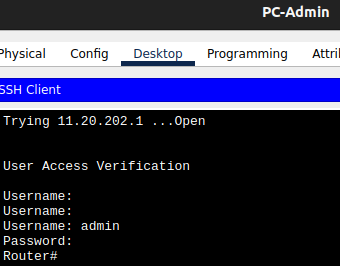

А остальные нет

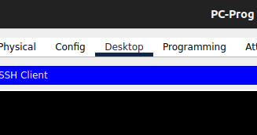

При этом доступ к интернету есть

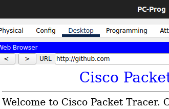


# часть2
- У разработчиков гит не работает(ssh) - нужно поправить правила.
- Админ узнал про ssh и решил тоже на него перейти
- количество сотрудников растет, всем прописывать адреса вручную стало накладно.
## Обновление схемы
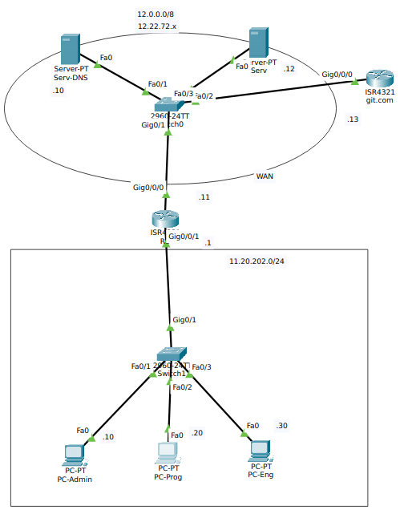
## Доступ к гиту
для гитхаба настраиваю эмулятор ssh на роутере ssh.com:
``` git\.com
enable
config term
	hostname git
	service password-encryption
	banner motd x hello, be nice x
	no ip domain-lookup
	
	line console 0
		password cisco
		login
	exit
	
	ip domain-name git.com
	crypto key generate rsa general-keys modulus 1024
	username CaptainProfit privilege 15 secret git
	username gitadmin privilege 15 secret admin
	line vty 0 15
		transport input all
		password cisco
		login
		login local
		transport output ssh
		transport input ssh
	exit

	interface gi 0/0/0
		ip address 12.22.72.13   255.0.0.0
		no shut
	exit

exit

clock set 11:18:00 jan 31 2026
terminal history size 256
copy ru st
```

 И он работает

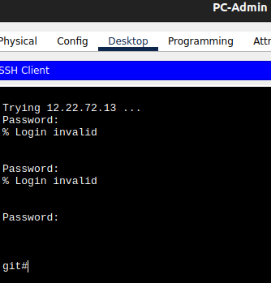

Но только с машины админа.
``` R1
conf t
	ip access-list extended Sec
	no 31
	31 permit tcp any host 12.22.72.13
	35 deny tcp any any range 22 telnet (36 match(es))
exit
```
Теперь разработчикк доволен и всё ещё не имеет доступ к серверу.

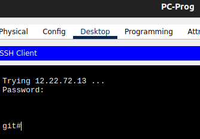
## Настройка ssh

Себе тоже сделаю ssh
``` R1
config term
	hostname R1
	ip domain-name kontora.ru
	username admin privilege 15 secret admin
	crypto key generate rsa general-keys modulus 1024
	line vty 0 15
		transport output ssh
		transport input ssh
		password cisco
		login
		login local
	exit
exit
```

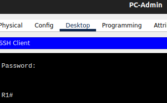

## Настройка DHCP
``` R1
conf t
	ip dhcp pool workers
		default-router 11.20.202.1
		domain-name contora.ru
		dns-server 12.22.72.10
		network 11.20.202.0 255.255.255.0
	exit
	ip dhcp excluded-address 11.20.202.1 11.20.202.19
service dhcp
```
Админу и узлам сети оставляю пул статических адресов. Работников перевожу на DHCP

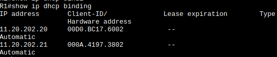
# часть3
- Появляется новое крыло и туда нужно поставить коммутатор и на него прокинуть несколько проводов, для надежности
- В процессе работы провода перепутались и один из кабелей оказался присоединён в сеть другой конторы. 
- Появилась потребность в Nat
## Ethercahnnel в новое крыло
Хочу LACP
``` S1_S2
ena
conf t
	inter range fa 0/10-12
		channel-group 1 mode active
		channel-protocol lacp
	exit	
```
Заработало

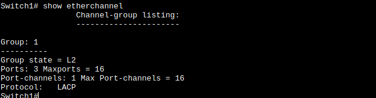

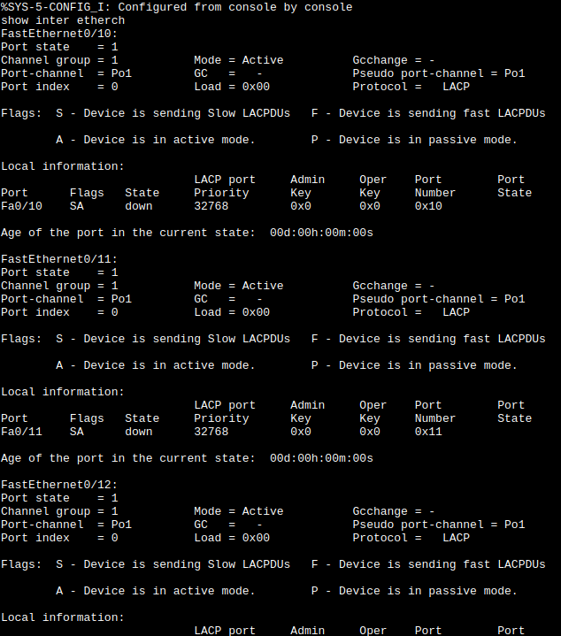
# Производим ревизию схемы с помощью LLDP и ищем проблемный кабель.
У одного из пользователей не работает корпоративная почта. Какимто чудом он получил адрес 11.20.203.43.

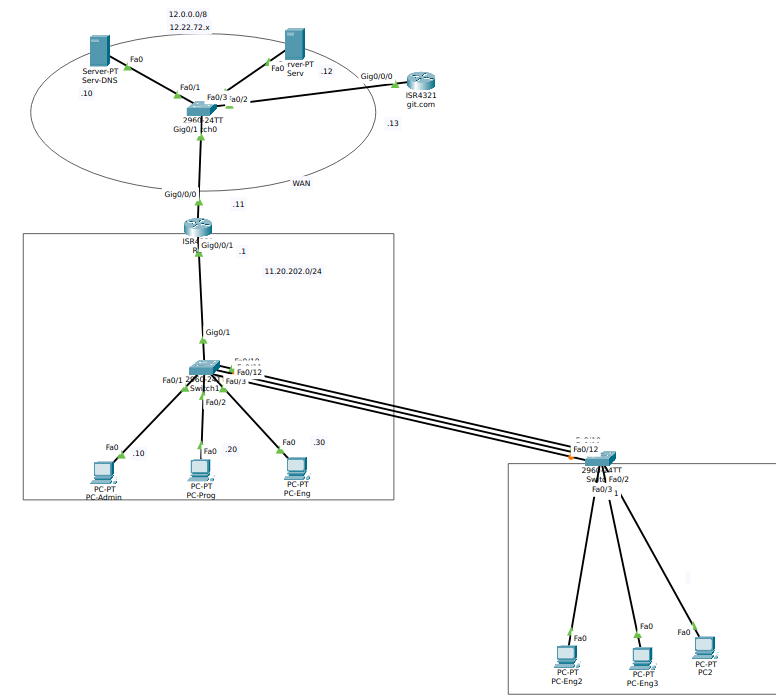

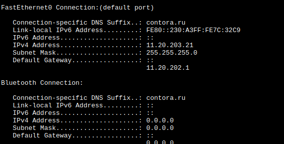

Что покажет нам CDP `show cdp neighbours`:

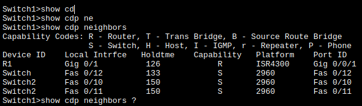

Ничего криминального.  А`show cdp entry *`:

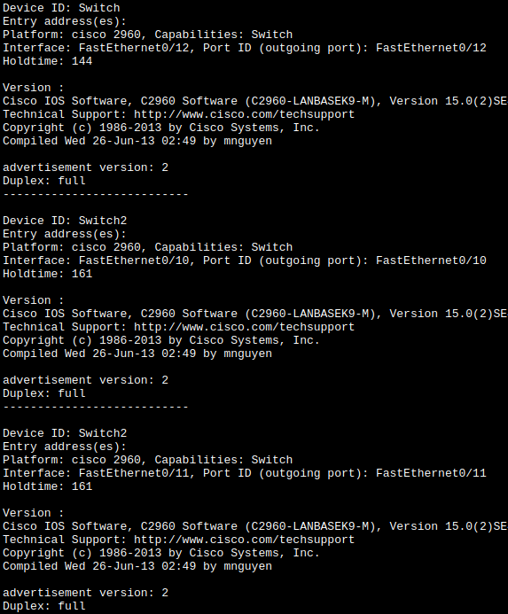

Обращаю внимание на Device ID и Interface - у fa 0/10 и fa0/11 всё правильно, а у fa0/12 какойто левый. Иду ищу его и перетыкаю.
Выяснилось, что какой-то кабель шел в сетку соседней конторы, вот так я это выдумал.

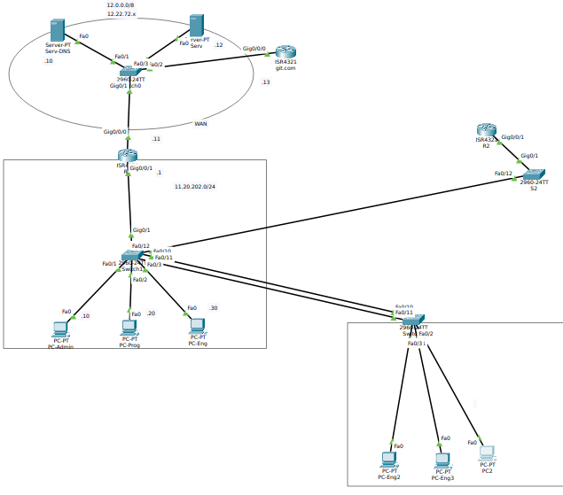

Поправил и сменил адрес 

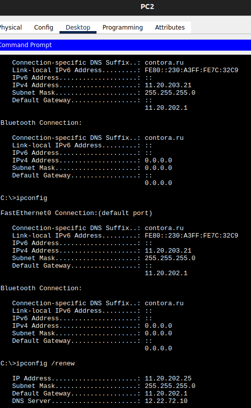
## Реализую NAT
И тут я встрял, как бы его показать то. Раньше вся сетка была настроена на публичные адреса - поправить это будет проблематично - и правила на них настроены, и DHCP, о, есть же нат на интерфейс:
```
conf t
	access-list 1 permit 11.20.202.0 0.0.0.255

	ip nat inside source list 1 interface gi 0/0/0 overload
	
	interface gi 0/0/0
		ip nat outside
	exit
	interface gi 0/0/1
		ip nat inside
	exit
```

Не понятно, работает ли нат, но адреса компьютеров всё ещё видны изнутри, так что польза сомнительная, нужно всё таки всё переводить на приватную сеть, но ктож знал в начале?
# часть4
- делаю дублирование шлюза
- делаю резервирование сетки коммутаторов
## реализация
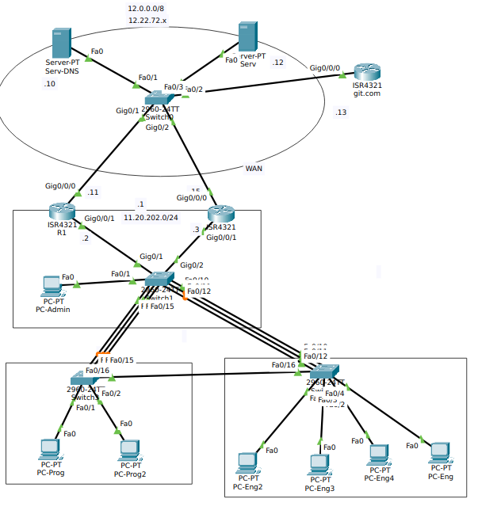
## резервирование путей к работникам
Нужно настроить новый Etherchannel-канал, пусть будет другой протокол.
``` S1_S3
ena
conf t
	inter range fa 0/13-15
		channel-group 2 mode desirable
		channel-protocol pagp
	exit	
```
И добавляю провод между департаментами, на случай если ктото рубанет топором по связке - хотя бы какойто доступ будет.
Так, наблюдаю в эмуляторе неправильное поведение:

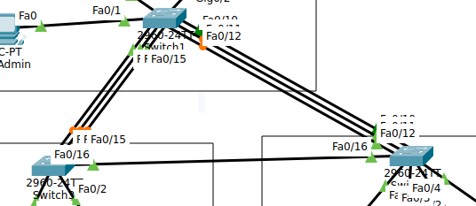

- Во первых кабель между switch3 и switch2 сугубо резервный, а он сейчас настроился основным, надо это поведение изменить
попробую самое простое:
`spanning-tree vlan 1-1000 root primary`
И это сработало. Было:

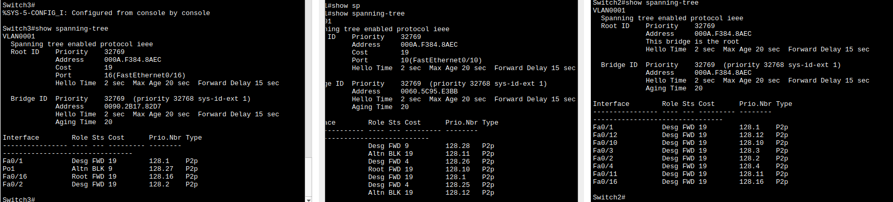

Стало

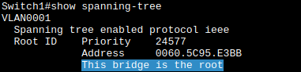

И по симуляции пакеты теперь не идут по резервному каналу.
- Во вторых езерченель справа не распределяет нагрузку. Потому что недонастроил, выбрал моду и теперь все зелененькие, отлично:

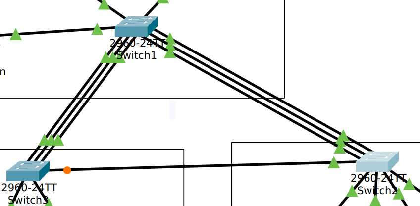
## дублирование шлюза
настраиваю HSRP на R1 и новом R2:
```
ena
conf t
	inter gi 0/0/1
		no ip add
		ip add 11.20.202.2 255.255.255.0 # для R2 .3
		standby version 2
		standby ip 11.20.202.1
```
И этого достаточно

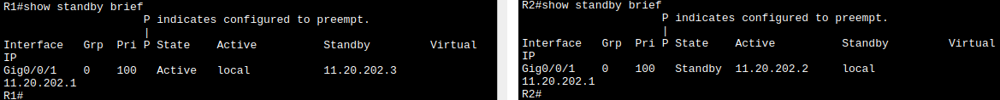

Сейчас работает R1, но вот я дергаю провод у R1 в сторону сети и... Сеть упала. А всё потому что эмуляция моей сети кривая и везде шлюзом задан мой R1, значит и с другой стороны настрою дублирование.
```
ena
conf t
	inter gi 0/0/0
		no ip add
		ip add 12.22.72.15 255.0.0.0 # для R2 .16
		standby version 2
		standby ip 12.22.72.11
```

Наверное в жизни так делать не надо, провайдер интернета со своей стороны разберется, но я не понимаю сейчас как происходит подключение пользователя к провайдеру. Ну и теперь восстановление работает только если активный роутер полностью выключается. Обрыв только одной из магистралей приводит к destination unreachable, что резонно - с при обрыве кабеля с одной стороны с другой активность роутера сохраняется потому что сохраняется связность. Остановлюсь на 
этом.
Поперезагружал роутеры, вот результат:

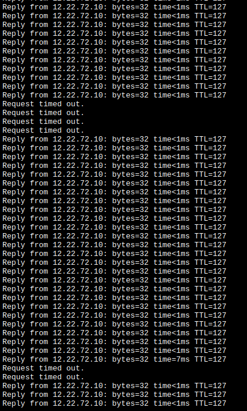


# часть4 разделяю на VLAN

|              | подсеть | доступ |
| ------------ | ------- | ------ |
| админ        | 10      | везде  |
| разработчики | 20      | S1     |
| Инжинеры     | 30      | S2     |
| parking      | 999     | нигде  |
| native       | 1000    | везде, |
``` S1_S2_S3
vlan 10
	name Admin
exit

vlan 20
	name Progs
exit

vlan 30
	name Engineers
exit

vlan 999
	name Parking_Lot
exit

vlan 1000
	name native
exit
```

``` S1
interface fa 0/1
	switchport mode access
	switchport access vlan 10

interface range fa 0/2-9, fa 0/16-24
	switchport mode access
	switchport access vlan 999
	shut

interface po 1
	switchport mode trunk
	switchport trunk native vlan 1000
	switchport trunk allowed vlan 10,30,1000

interface po 2
	switchport mode trunk
	switchport trunk native vlan 1000
	switchport trunk allowed vlan 10,20,1000

interface vlan 10
	ip address 11.20.202.4 255.255.255.0
	no shut
exit
```
`show vlan brief`:

``` S3
interface range fa 0/1-12, fa 0/16-24
	switchport mode access
	switchport access vlan 20

interface po 2
	switchport mode trunk
	switchport trunk native vlan 1000
	switchport trunk allowed vlan 10,20,1000

interface fa 0/16
	switchport mode trunk
	switchport trunk native vlan 1000
	switchport trunk allowed vlan 10

interface vlan 10
	ip address 11.20.202.5 255.255.255.0
	no shut
exit
```

``` S2
interface range fa 0/1-9, fa 0/13-24
	switchport mode access
	switchport access vlan 30

interface po 1
	switchport mode trunk
	switchport trunk native vlan 1000
	switchport trunk allowed vlan 10,30,1000

interface fa 0/16
	switchport mode trunk
	switchport trunk native vlan 1000
	switchport trunk allowed vlan 10

interface vlan 10
	ip address 11.20.202.6 255.255.255.0
	no shut
exit
```

С отладкой пришлось повозиться - неправильно настроил native vlan и пока не отменил его со значением - он не перенастраивался, хо но вот результат
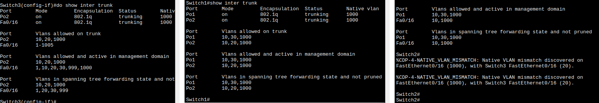

Для связности с интернетом и между собой необходимо ещё поднять подинтерфейсы на маршрутизаторах:
``` R1_R2
inter range gi 0/0/1.10, gi 0/0/1.20, gi 0/0/1.30
	no shut
```
Этого не достаточно, каждому нужно по адресу, а адрес требует инкапсуляции, а ещё адрес пересекается с адресом полного интерфейса. Требуется пересборка всего DHCP. Заодно вспоминаю, что раз я копировал R2 c R1 - то ии DHCP в нем тоже дублировался.
- Разъезжаемся на подсети
``` R1
inter gi 0/0/1
	no ip add
	ip add 11.20.202.2 255.255.255.192
inter gi 0/0/1.10
	encaps dot
	ip add 11.20.202.66 255.255.255.192
inter gi 0/0/1.20
	encaps dot
	ip add 11.20.202.130 255.255.255.192
inter gi 0/0/1.30
	encaps dot
	ip add 11.20.202.194 255.255.255.192
```

- Так же у меня маршрутизаторы подключены через Switch1:gi 0/1-2 - их тоже настроить надо
```
inter range gi 0/1-2
	no shut
	switchport mode trunk
	switchport trunk native vlan 1000
	switchport trunk allowed vlan 10,20,30,1000
```
- меняю адреса свичей, раз я из в 10й влан перетащил
``` S1
inter vlan 10
	no ip add
	ip add 11.20.202.68 255.255.255.192
```
``` S3
inter vlan 10
	no ip add
	ip add 11.20.202.69 255.255.255.192
```
``` S2
inter vlan 10
	no ip add
	ip add 11.20.202.70 255.255.255.192
```

- меняю DHCP пулы
```
conf term
	no ip dhcp pool workerks
	
	ip dhcp excluded-address 11.20.202.128 11.20.202.138
	ip dhcp pool workerks20
		default-router 11.20.202.130
		dns-server 12.22.72.10
		domain-name workers20.kontora.ru
		network 11.20.202.128 255.255.255.192

	ip dhcp excluded-address 11.20.202.192 11.20.202.202
	ip dhcp pool workerks30
		default-router 11.20.202.194
		dns-server 12.22.72.10
		domain-name workers30.kontora.ru
		network 11.20.202.192 255.255.255.192
```

В результате сетки разделил, связность между устройствами имеется,

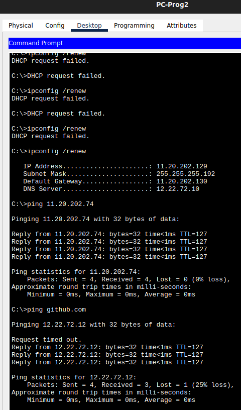

Из забавного не могу запинговать коммутаторы с хостов: эхо-запросы отправить к ним могу, но так как они в другом VLAN - у коммутатора не настроен шлюз по умолчанию и по этому ответы не возможно отправить. Можно выполнить `ip default-gateway 11.20.202.130` , но пользователям пинговать коммутаторы не требуется.

**Последняя проблема**: - Так как оказалось, что vlan подразумевает разделение по подсетям и единый интерфейс gi 0/0/1 не принимает - у меня так же сломалось дублирование шлюза, придется его тоже перенастраивать:
- Для начала повторить "разъезд на подсети" на роутере2:
``` R2
inter gi 0/0/1
	no ip add
	ip add 11.20.202.3 255.255.255.192
inter gi 0/0/1.10
	encaps dot 10
	ip add 11.20.202.67 255.255.255.192
inter gi 0/0/1.20
	encaps dot 20
	ip add 11.20.202.131 255.255.255.192
inter gi 0/0/1.30
	encaps dot 30
	ip add 11.20.202.195 255.255.255.192
```
- теперь в пулах нужно поправить дефолтный гейт:
```
ip dhcp pool workerks20
	default-router 11.20.202.129
		
ip dhcp pool workerks30
	default-router 11.20.202.193
```
- И повторить дублирование для каждого подинтерфейса на обоих роутерах. Ну и раз мы здесь - пусть 20я подсеть предпочитает идти через R1, а 30я - через R2
``` R1_R2
inter gi 0/0/1.10
	standby version 2
	standby ip 11.20.202.65

inter gi 0/0/1.20
	standby version 2
	standby ip 11.20.202.129
	standby priority 10 #R2 100

inter gi 0/0/1.30
	standby version 2
	standby ip 11.20.202.195
	standby priority 100 #R2 10
```

Вот что получается:

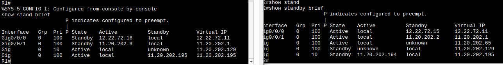

Теперь нужно пройтись по всем компам и сделать им `ipconfig /renew`, а то они там наловили адресов из старых настроек, и только через неделю их отпустят. Наблюдал даже, как пинг во внешнюю сеть отправился от хоста к соседнему хосту, потому то у этого хоста был апишник "нового" шлюза, так что ещё и arp таблицу надо почистить , а то адресация претерпела множественные изменения. 
В процессе выяснилось, что у инженеров нет интернета. Это потому что я промахнулся адресом виртуальным:
```
inter gi 0/0/1.30
	standby ip 11.20.202.193
```
Так, а че это там ещё за анкновны в `show standby brief`. Ещё и нету интерфейса одного в R1:
- В R1 повторяю настройку 10 подинтерфейса - пропадает анкновн по 64
- заного настроил адреса для 20 подинтерфейса - теперь всё выглядит лучше:

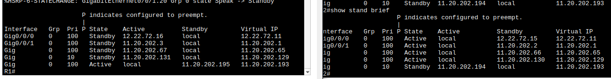

Чудесно, проверю выключение одного из роутеров:


Я правда ожидал, что "переключения " будут не синхронными, я всё таки приоритеты по разному задал.
# Итого
Что потрогал:

| часть | Технологии                                     |
| ----- | ---------------------------------------------- |
| 1     | OSPF<br>IP routing<br>DNS<br>ACL<br>telnet     |
| 2     | ssh<br>DHCP                                    |
| 3     | etherchannel<br>LLDP<br>NAT interface overload |
| 4     | STP<br>FHRP                                    |
| 5     | VLAN                                           |

С чем не справился:  OSPF.

Что стоит добавить: 
1) Сразу строить внутреннюю сеть на приватных адресах и сразу использовать NAT для выхода.
2) Сразу бить на логические подсети.
3) Научиться строить зоны OSPF и коммутировать их друг с другом.
4) Разобраться, как происходит подключение пользователя к провайдеру.
5) Добавить техники безопасности L2 уровня:
	1) DHCP snooping,
	2) перевести неактивные порты в состояние доступа и отключить,
	3) добавить portfast и BPDU-Guard, 
	4) отключить DTP где он не нужен,
	5) добавить защиту ARP таблиц.
6) Рассмотреть реальные схемы сетей.