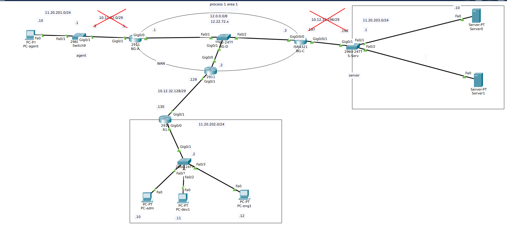

# Схема
# Чего хочу
# часть1

Небольшой коллектив, строим сеть с нуля
- настроить ОSPF для эмуляции WAN
- создать сеть для офиса на 3х человек.
- запретить ssh трафик в сети
## реализация
### настройка эмуляции сети
(configs/chapter1/BG-A)[https://github.com/CaptainProfit/NWHW_01/edit/main/proj/configs/chapter1/BG-A]


|        | Gi-0/0       | Gi-0/1         | конфиг                      |
| ------ | ------------ | -------------- | --------------------------- |
| BG-A   | 11.22.72.1/8 | 11.20.201.1/24 | (configs/chapter1/BG-A)[https://github.com/CaptainProfit/NWHW_01/edit/main/proj/configs/chapter1/BG-A] |
| BG-B   | 11.22.72.2/8 | 11.20.202.1/24 | [[configs/chapter1/BG-B]]   |
| BG-C   | 11.22.72.3/8 | 11.20.203.1/24 | [[configs/chapter1/BG-C]]   |
| R-side |              |                | [[configs/chapter1/R-side]] |
| R-serv |              |                | [[configs/chapter1/R-serv]] |
| R1     |              |                | [[configs/chapter1/R1]]     |

Например для ноды BG-A:
![[configs/chapter1/BG-A]]

для ноды R-side:
![[configs/chapter1/R-side]]

## проверка
в процессе пинговал с хостов друг друга
изначально чегото не получалось
использовал
```
show ip rote
show ip ospf neighbour
clear ip ospf process
router::default-information originate
```

# часть2
- количество сотрудников выросло, подсети не хватает на всех
- появилась база в облаке - сотрудникам нужен доступ к ней
- У разработчиков гит не работает(ssh) - нужно поправить правила.
- Представитель постоянно в разъездах, и ему нужен доступ к PC-eng2
## реализация
## проверка

# часть3


Со временем контора расширяется, появляется гораздо больше сотрудников, выделяют несколько департаментов, некоторые расположены в другом крыле здания. 
- выделить каждому департаменту подсеть
- настроить NAT для выхода в сеть
	- одному разработчику нужен статический IP
- прокинуть etherchannel до коммутатора в другом крыле 9департамент инженеров).
- отключить всем доступ к ssh сети
- Старый сетевой инженер уходит, приходит новый. Прежде чем пойти в обход решает составить схему с помощью LLDP
- Новый инженер запрещает инженерам ssh соединение в целях усиления безопасности, но у разработчиков отваливается гитлаб - приходится добавить его в белый список. 
## реализация
## проверка

# часть4

- делает дублирование первого контура
- создает двойной NAT 
- разработчику понадобился статический айпи
- в департаментах назрела нехватка адресов в подсети - прокидывает VLAN с дополнительной подсетью и часть департаментов переводит на неё, при этом пользователи должны иметь доступ друг к другу для работы.
## реализация
## проверка

# Итого

| часть | Технологии           |
| ----- | -------------------- |
| 1     | OSPF<br>DHCP<br>ACL  |
| 2     | static NAT<br>NAT    |
| 3     | etherchannel<br>LLDP |
| 4     | STP<br>VLAN<br>FHRP  |

